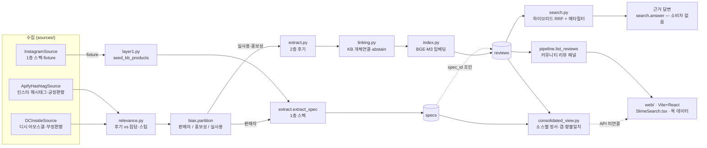
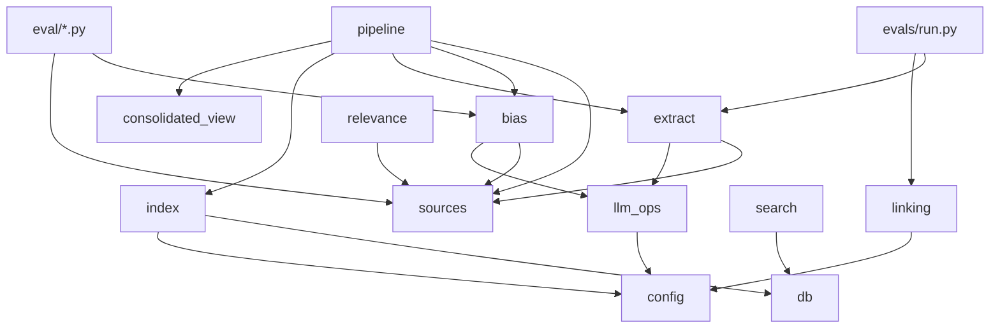

# ARCHITECTURE — 슬라임 리뷰 RAG

한국 슬라임 마켓의 **공식 스펙(1층, 정형)** + **사용자 후기(2층, 비정형)** 를 통합해
출처를 인용하며 답하는 근거 기반 RAG. 소스 편향(인스타=긍정 / 디시=부정)은 보정 대상이
아니라 **1급 기능** — 평균내지 않고 소스별 + 갭으로 투명하게 노출한다.

모듈별 상세는 각 `CLAUDE.md`: [slime_rag](slime_rag/CLAUDE.md) ·
[eval](eval/CLAUDE.md) · [evals](evals/CLAUDE.md) · [sql](sql/CLAUDE.md).
프런트엔드는 `web/`(Vite + React + TS) — 디자인 HTML 을 그대로 옮긴 화면이고 **아직 목 데이터**다
([ADR-0012](docs/adr/0012-remove-streamlit-frontend.md)).
도메인 결정 근거는 [MEMORY.md](MEMORY.md) · [docs/adr/](docs/adr/).

## 데이터 흐름 (파이프라인)

> `UI` 로 가는 화살표는 **아직 점선이다**. HTTP API 가 없어서 `web/` 은 [목 데이터](web/src/data/mock.ts)를 읽는다.
> `pipeline` 의 `list_*` / `consolidated_for` / `answer` 가 표시 계층의 계약이고,
> API 층은 그 셋을 그대로 노출하면 된다.

## 모듈 의존성 (누가 누구를 import 하나)

## 아키텍처 원칙 (경계와 그 이유)
- **LLM 벤더 격리**: 모든 LLM 호출은 `slime_rag/llm_ops.py` 한 곳. 벤더 교체가 파이프라인
  무변경으로 끝난다(Anthropic→OpenAI 전환이 증거). 로깅·토큰·비용·재시도도 여기 집중.
- **소스 플러그인**: 수집은 `Source` 인터페이스 뒤. 소스 추가 = `sources/` 에 구현체 하나.
- **UI 는 표시만**: 표시 계층은 데이터 접근을 갖지 않는다 — 전부 `pipeline` 이 캡슐화(테스트·재사용).
  평가 기준·링크·로고 **판단**은 전부 UI 밖(`consolidated_view.CRITERIA` · `source_links`)에 있다.
  이 경계 덕분에 프런트엔드를 통째로 버려도 백엔드는 한 줄도 안 바뀌었다(ADR-0012 가 그 증거).
- **DB 가 조인·집계의 자리**: 향 불일치·소스 갭은 LLM 이 아니라 SQL 조인/집계에서 계산.
- **2층 데이터 아키텍처**: 1층(specs, 객관) ↔ 2층(reviews, 주관)을 `spec_id` 로 조인.

## Cross-module ripple (변경 영향)
| 바꾸는 것 | 파급 |
|---|---|
| `sql/schema.sql` 컬럼 | `db.py` · `index.py` · `search.py` · `consolidated_view.py` |
| `extract.LAYER2_SCHEMA` | `index.py`(비정규화 승격) · `sql`(메타 컬럼) · `evals` 골드 |
| 임베딩 모델 | `index.py` · `search.py` · `schema.sql`(벡터 차원·인덱스 재생성) |
| 새 소스 | `sources/` 구현체 + `pipeline.collect` 등록만 — 하류 무변경 |
| LLM 벤더/모델 | `llm_ops.py` 만 |
| 마켓 로고 자산 | KB `markets[].logo` · `data/market_logos/` · `source_links.logo_asset` · 프런트엔드 |
| `consolidated_view.CRITERIA` | `SOURCE_REVIEW_SCHEMA`(required) · 3개 요약 프롬프트 · 프런트엔드 평가 기준 표 — **한 리스트가 셋을 동시에 움직인다**(ADR-0011) |
| `reviews` 에 작성일·반응수 컬럼 추가 | `pipeline.REVIEW_SORTS`(정렬 메뉴) · `list_reviews` · 리뷰 카드 라벨('수집' → '작성') |

## 배포 (마지막 하드게이트)
Render(관리형 Postgres+pgvector) → `schema.sql` 적용 → 정적 사이트(`web/`) + API 웹서비스 2개.
화면은 다시 있으나 **API 층이 없어** 아직 실데이터를 못 띄운다 — 그게 이 게이트의 선행 조건이다.
로컬은 `.venv` + `docker compose up -d`(포트 55432).
