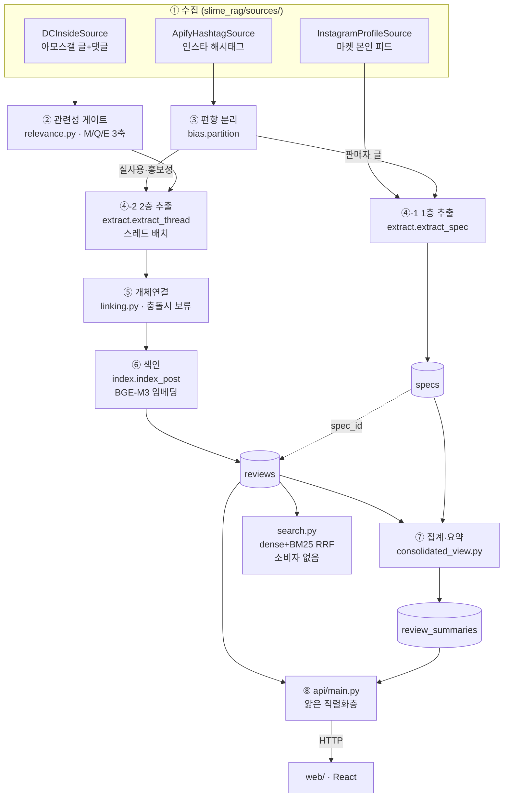
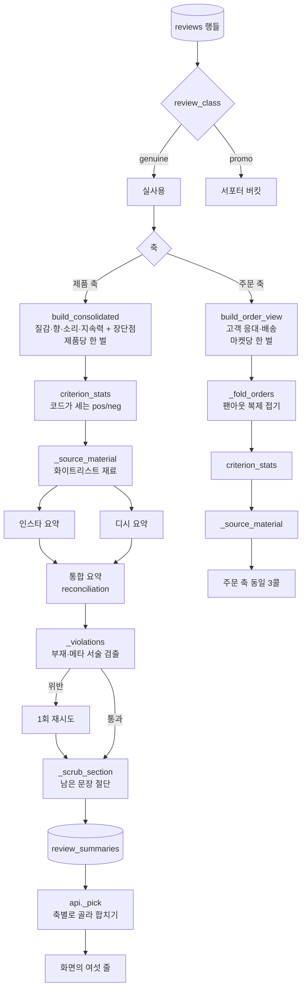

# 시스템 개요 — 전체 파이프라인과 요약 시스템

이 문서는 두 가지를 설명한다.

1. **전체 시스템** — 인스타/디시에서 글 한 줄이 들어와 화면의 카드가 되기까지.
2. **요약 시스템** — 그 중에서도 `consolidated_view.py` 가 하는 일. 이 저장소에서 가장 규칙이
   많은 부분이고, 대부분의 규칙은 "LLM 에게 부탁하지 말고 코드로 강제한다"의 사례다.

지도 성격의 문서는 따로 있다 — [ARCHITECTURE.md](../ARCHITECTURE.md)(흐름도·의존성),
[CLAUDE.md](../CLAUDE.md)(현재 상태), [MEMORY.md](../MEMORY.md)(도메인 규칙),
[docs/adr/](adr/)(결정 기록). 여기서는 **왜 이렇게 생겼는지**를 이어서 읽을 수 있게 서술한다.

---

## 0. 이 시스템이 답하려는 질문

> "이 슬라임, 실제로 어때요?"

슬라임 마켓의 후기는 두 곳에 산다. **인스타그램**(구매자가 예쁘게 찍어 올린 글 — 구조적으로 긍정
편향)과 **디시인사이드 아모스 갤러리**(익명 커뮤니티 — 구조적으로 부정 편향). 두 곳의 말은
같은 제품에 대해서도 자주 어긋난다.

이 프로젝트의 입장은 **그 어긋남을 보정하지 않는다**는 것이다. 두 출처의 점수를 평균내면
"3.5점짜리 무난한 제품"이 되어 정작 사람이 알고 싶은 정보가 사라진다. 대신
**출처별로 따로 집계하고, 갭을 그대로 보여준다**([ADR-0002](adr/0002-source-bias-first-class.md)).
소스 편향은 버그가 아니라 **1급 기능**이다.

여기에 두 개의 층을 겹친다.

| 층 | 무엇 | 출처 | 성격 |
|---|---|---|---|
| **1층 (Layer 1)** | 공식 스펙 — 향료·풀조합·종류·판매자의 질감 서술 | 마켓 본인 인스타 게시물 | 정형·객관 |
| **2층 (Layer 2)** | 사용자 후기 — 질감·향·소리·지속력·배송·응대 평가 | 인스타 해시태그 + 디시 아모스갤 | 비정형·주관 |

두 층은 `specs.id ← reviews.spec_id` 로 조인된다. "공식향은 연유향인데 후기 23건 중 8건이
비누향이라고 한다" 같은 문장은 **이 조인에서만** 나올 수 있고, LLM 이 만들 수 있는 문장이 아니다.

---

## 1. 전체 파이프라인



### ① 수집 — `slime_rag/sources/`

모든 수집기는 `Source` 인터페이스 뒤에 있고 `RawReview(text, url, platform, meta)` 를 뱉는다.
소스를 하나 추가하는 일 = `sources/` 에 파일 하나 추가하는 일이고, 하류는 안 바뀐다.

- **`DCInsideSource`** — 아모스 갤러리. **댓글도 1급 후기로 취급한다**(이 갤은 후기가 댓글에
  더 많다). 글 하나 + 그 댓글들이 한 "스레드"를 이룬다.
- **`ApifyHashtagSource`** — 인스타 해시태그. 검색어는 **제품명만** 쓴다(마켓명·'슬라임' 같은
  광역어는 노이즈만 끌어온다 — memo `hashtag-search-product-name-only`).
- **`InstagramProfileSource`** — 마켓 **본인 계정 피드**. `business_discovery` API 가 App Review
  벽에 막혀서([ADR-0003](adr/0003-ig-businessdiscovery-fixture.md)) 뚫은 우회로다. 해시태그
  경로와 달리 **랭킹 편향이 없지만**(피드 전체) 액터가 최신 ~12개만 준다.

수집 원칙: robots·딜레이·페이지 캡. 수집한 바이트는 **git 에 커밋하지 않는다**(예외 하나 —
마켓 로고, [ADR-0010](adr/0010-market-logo-assets.md)).

### ② 관련성 게이트 — `relevance.py`

수집한 글이 "우리가 찾는 타깃에 관한 것"인지 판정한다. **LLM 을 쓰지 않는다** — 색인용으로
이미 로드한 BGE-M3 임베딩을 재사용해 추가 비용이 0이다.

- **Axis 1 (topic)** — 타깃 앵커("봄 허니푸냥이 슬라임")와 **청크 최대 코사인**. 전체글 임베딩을
  쓰면 한 줄짜리 신호가 희석되므로 문장 단위로 끊어 최댓값을 본다.
- **Axis 2 (M/Q/E)** — 독립 이진 3축([ADR-0006](adr/0006-mqe-three-axis-relevance.md)).
  배타적 4분류를 쓰던 시절 centroid 가 붕괴한 것이 교체 이유다.
  - `M` (갤 메타·드라마·뉴스) — **유일한 DROP 사유**
  - `Q` (질문 화행) — **순수 관측 축.** 정렬 키에 들어가지 않는다
  - `E` (1인칭 실사용 평가) — 순위의 주 신호. 규칙 캐스케이드 ∪ 로지스틱 프로브
- **하드게이트** — 부정 감성 항목은 `E=0` 이어도 `bias_hold` 로 후보에 남는다. 부정 후기 1건을
  잃는 손해가 헛호출 10회보다 비싸다. 소스 편향이 조용히 깎이는 걸 막는 자리다.
- 예산을 넘긴 항목은 **드롭이 아니라 `unprocessed`** 로 센다. 침묵 절단 금지.

판정 전문은 `reviews.relevance_meta` JSONB 에 저장된다(하드게이트 #3 — 실패 추적).

### ③ 편향 분리 — `bias.py`

인스타 수집물에는 세 종류가 섞인다.

```
판매자 글  → 1층 스펙으로 라우팅   (KB 핸들 역인덱스, 결정적)
홍보성 후기 → review_class='promo'  (별도 버킷 — 드롭 아님)
실사용 후기 → review_class='genuine'
```

홍보성 판정은 **게이트 → LLM 캐스케이드**다([ADR-0004](adr/0004-promo-gate-llm-cascade.md)).
값싼 키워드 게이트가 recall 을 담당해 "홍보 의심"만 통과시키고, precision 은 LLM 이 맡는다.
명백한 실사용은 게이트에서 즉시 단락 → LLM 호출이 5~10× 줄어든다.

도메인 규칙이 여기 박혀 있다: **할인·서비스·비매품은 구매 맥락이지 홍보가 아니고**,
**서포터·체험단·협찬만 홍보다**(memo `promo-vs-purchase-domain-rules`). 그래서 "서포터분들은
얄랑하다 했지만 제가 만졌을 땐 매트했어요"는 genuine 이다 — 남을 인용했을 뿐이니까.

### ④ 추출 — `extract.py`

비정형 텍스트 → 정형 JSON. 결정성은 temperature 가 아니라 **structured outputs(strict)** 로
확보한다(GPT-5 계열은 추론 모델이라 temperature 를 무시/제한한다).

**1층** (`extract_spec`) — 판매자 캡션 → `{product, scent, base_combo, slime_type,
official_texture, beads}`. 결정적 게이트 둘이 LLM 판정 위에 얹힌다:

- 캡션에 제품 고유 해시태그가 없으면 → **통째로 스킵**(비매품·공지글이다).
- 제품명은 반드시 **그 캡션의 해시태그**여야 한다 → LLM 이 향료·재료어를 제품명으로 지어내도
  드롭. 이 게이트가 후기 경로에 없던 시절 인스타 80행 중 상당수가 유령 제품이었다
  (memo `phantom-products-from-review-path`).

**2층** (`extract_thread`) — 후기 → `{market, shipping_cs, reviews[], flags}`.
구조가 두 층인 게 핵심이다([ADR-0005](adr/0005-review-vs-product-unit.md)):

```
market · shipping_cs   ← 후기(주문) 단위 사실. 보통 1주문 = 1마켓
reviews[]              ← 제품 단위 평가. 비교글이면 제품 수만큼
```

두 개의 하드닝이 붙어 있다.

- **전언(hearsay) 차단** — "친구가 샀는데 걀걀거림 심하다고 함"은 가짜 부정 후기가 된다. 프롬프트
  지시만으로는 못 막는다(같은 입력 4회 호출에 4번 다른 답). 그래서 `firsthand_evidence` 를
  **필수 필드**로 요구하고, `drop_hearsay_reviews` 가 세 겹으로 검사해 코드로 버린다:
  ①근거 없음 ②근거가 원문에 실재하지 않음(지어낸 인용) ③근거 조각 자체가 전언 표지를 담음.
- **스레드 배치** — 호출당 입력 토큰의 **99.4%가 고정 프롬프트**였다(실측). 비용 레버는 분류
  정확도가 아니라 호출 단위다. 그래서 글+댓글을 `[S0] [S1] …` 로 번호 매겨 한 번에 보낸다.
  배치 크기 12는 캐시 하드스탑 실측치다(`Settings.max_thread_sources`).
  부수 이득: 형제 댓글이 같은 호출 안에 있어 **제품명을 생략한 댓글의 귀속**이 가능해졌다.

### ⑤ 개체연결 — `linking.py`

`mentioned_market`("ㅂㅉ") → 정규 `market_word`("빈짱"). KB 명부의 표면형(상호·표시어·핸들·별칭)과
**초성** 역인덱스로 결정적 매칭한다.

원칙은 **보류(abstain)** 다. 초성이 충돌하면(ㅁㅁ, ㅇㅇ 등 12그룹) 확신도를 나눠 임계 미만이면
`market=NULL` 로 둔다. **틀린 귀속 < 결과 없음** — 이 저장소 전체를 관통하는 규칙이다.

실측: 아모스갤 '빠코볼' 25건 중 원문 17조각의 **10개가 마켓을 아예 언급하지 않았다**. 등장한
`ㅈㄴ` 6건도 대부분 마켓이 아니라 부사 '존나'였다. 그래서 조회 API 는 마켓을 **선택**으로 받는다.

### ⑥ 색인 — `index.py`

**청킹 단위 = 제품 항목 1개 = 1행.** 비교글 하나는 제품 수만큼 행으로 팬아웃된다.

- 임베딩 대상은 원문이 아니라 **구조화 필드로 만든 렌더링 텍스트**
  (`[빈짱 한글과자한줌] / 향: 연유향 좋음 / 질감: 말랑 좋음 …`). 추출 항목 단위로 끊겨 있어
  청크 경계가 명확하기 때문이다. 원문 전문은 ADR-0013 이후 별도 컬럼에 함께 보관한다.
- BGE-M3 dense(1024차원) + kiwipiepy 형태소 토큰(BM25용)을 같이 넣는다.
- **팬아웃 복제** — `shipping_cs`·`relevance_meta`·`source_ref` 는 조각 단위 속성인데 행은
  제품 단위라, 제품별 행마다 **복제**된다. 이 복제가 나중에 요약의 가장 큰 함정이 된다(§2.2).
- **멱등성은 DB 제약이 갖는다** — `UNIQUE(source, post_id, product)` + `ON CONFLICT DO NOTHING`.
  주석만 '멱등'이라 주장하던 시절, 배치를 두 번 돌려 인스타 80행 중 28행이 중복이었다. 단순
  중복이 아니라 **같은 글이 런마다 다른 감성으로 추출돼**(LLM 비결정성) 독립 후기 두 건처럼
  집계에 들어갔다 — 그대로 편향 집계 오염이다.
  `DO UPDATE` 로 바꾸면 안 된다: 재수집마다 이미 내려진 판정을 조용히 덮어쓴다.

### ⑦ 집계·요약 — `consolidated_view.py`

**이 문서의 §2 전체.**

### ⑧ 표시 — `api/` → `web/`

- `api/main.py` 는 **얇다.** SQL·표시 정책·집계는 전부 `slime_rag` 안에 있고, 여기서 하는 일은
  `pipeline` 호출과 JSON 직렬화뿐이다. 로직이 여기서 자라면 백엔드가 두 벌이 된다.
- `/api/page` 는 **저장된 요약만 읽는다**(`with_summary=False`). 페이지 로드마다 LLM 을 부르면
  방문마다 과금된다.
- 화면에 나가는 본문은 **서버에서 자른 발췌**다([ADR-0013](adr/0013-processing-vs-publication.md)).
  저장·처리는 허용, 제한은 **표시**에만 걸린다. CSS `line-clamp` 는 발췌가 아니다 — 전문이 이미
  브라우저에 도달했으니까. 자르는 자리는 `pipeline.list_reviews` **한 곳**이다.

---

## 2. 요약 시스템

여기부터가 본론이다. 입력은 `reviews` 테이블의 행들, 출력은 화면의 여섯 줄이다.



### 2.1 왜 축이 둘인가 — 요약의 가장 중요한 구조

여섯 개 기준은 **한 리스트**에 산다. `consolidated_view.CRITERIA` 하나가 DB 스키마, 여섯 개
프롬프트, 화면의 표를 **동시에** 정의한다([ADR-0011](adr/0011-six-criteria-summary-and-search-page.md)).

```python
CRITERIA = [
    {"key": "texture",   "ko": "질감",      "scope": "product"},
    {"key": "scent",     "ko": "향",        "scope": "product"},
    {"key": "sound",     "ko": "소리",      "scope": "product"},
    {"key": "longevity", "ko": "지속력",    "scope": "product"},
    {"key": "cs",        "ko": "고객 응대", "scope": "market"},
    {"key": "shipping",  "ko": "배송",      "scope": "market"},
]
```

`scope` 가 최근에 붙었다([ADR-0015](adr/0015-market-scope-order-criteria.md)). 이유:

`shipping_cs` 는 **원래부터 주문 단위 필드**였다(ADR-0005). 그게 제품 행에 실려 있는 건
`index_post` 가 팬아웃마다 **복제**했기 때문이지 제품의 속성이라서가 아니다. 그런데 요약을
제품별로 돌리면:

- 비교글 하나의 배송 불만이 그 글이 언급한 **모든 제품의 요약**에 각각 관측된 것처럼 실린다.
- 같은 마켓의 제품 페이지들이 결국 **같은 두 문장을 반복**한다.
- 비용도 제품 수만큼 든다.

이건 표시 문제가 아니라 **귀속(attribution) 오류**다. 그래서 요약이 둘로 갈렸다.

| | 제품 축 | 주문 축 |
|---|---|---|
| 함수 | `build_consolidated` | `build_order_view` |
| 기준 | 질감·향·소리·지속력 | 고객 응대·배송 |
| 장단점 | 있음 | **없음** (한 화면에 목록 둘이면 어느 걸 읽어야 할지 모른다) |
| 단위 | 제품당 한 벌 | **마켓당 한 벌** |
| 저장 행 | `product IS NOT NULL` | `product IS NULL` |
| 생성 | `pipeline.generate_summaries(market, product)` | `pipeline.generate_market_summaries(market)` |

화면은 여전히 여섯 줄을 보여준다 — 마켓 축 두 줄을 **빌려 와서** `'이 마켓 전체 주문 기준이에요'`
라고 라벨을 붙인다.

> ⚠️ 한 축의 프롬프트에 다른 축의 기준을 설명하면 안 된다. **담을 칸이 없으면 모델이 그 내용을
> 남은 칸에 밀어 넣는다.** CI 게이트가 있다 —
> `test_axis_prompts_never_mention_the_other_axis`.

### 2.2 팬아웃 접기 — `_fold_orders`

주문 축 재료는 **조각 단위로 접고 나서** 쓴다. 안 접으면 한 주문의 배송 이야기가 그 글이
언급한 제품 수만큼 세어진다.

```python
key = source_links.evidence_group_key(r.get("source_ref"))
```

접는 키는 근거 목록·커뮤니티 패널이 쓰는 것과 **같은 조각 식별자**다. 한 조각을 세는 규칙이
화면마다 갈리면 건수가 화면마다 달라진다.

두 가지 결정이 여기 박혀 있다.

- **내용 해시로 접지 않는다.** 서로 다른 주문의 "배송 빨라요"가 한 건으로 접히는 **과소 집계**는
  과대 집계보다 알아채기 어렵다(화면에 이상이 안 보인다).
- **식별자가 없는 행(ADR-0009 이전 색인분)은 접지 않고 그대로 남긴다.** 해결은 재수집뿐이다.

그리고 이건 **이전 방식의 교정**이기도 하다. 예전엔 프롬프트가 모델에게
*"같은 주문의 배송 얘기를 제품 수만큼 부풀려 세지 마라"* 라고 **부탁**했다. 이 저장소의 규칙은
그 반대다 — **규칙은 프롬프트에 적고, 강제는 코드가 한다.**

### 2.3 다수/소수는 코드가 센다 — `criterion_stats`

각 기준의 **출처별 정서 건수**를 코드가 집계한다.

```python
{"texture": {"by_source": {"instagram": {"pos": 23, "neg": 1, "n": 24}, ...},
             "total": {...}, "only_source": None, "split": True}}
```

왜 LLM 에게 안 맡기나 — **실측 때문이다.** 저장된 요약이 `향 평가는 인스타에서만 나와요` 라고
썼는데, 집계는 **인스타 23 · 아모스갤 1** 이었다. LLM 이 소수를 0으로 반올림한 것이다.

향 불일치(`scent_divergence`)·소스 갭(`sentiment_gap`)을 SQL 조인·집계에서 계산하는 것과 정확히
같은 이유다. **숫자는 코드가 내고, 문장은 내용만 쓴다.**

`criterion_stats` 는 두 곳에 쓰인다.

1. **프롬프트 재료** — 압축된 pos/neg 카운트가 들어간다. ⚠️ 숫자를 문장에 쓰라는 재료가 아니라,
   **어느 쪽을 `verdict` 에 둘지 고르라는** 재료다.
2. **provenance 스냅샷** — 요약과 같은 행에 저장된다. 나중에 후기가 늘면 실시간 집계와 달라지므로,
   그때 그 문장의 근거는 여기에만 남는다.

**화면에는 안 나간다.** 배지(`인스타만` · `인스타 27 · 아모스갤 6` · `갈림 19:5`)로 띄워 봤다가
전부 걷어냈다(사용자 결정 2026-08-07) — 다수/소수는 이미 `verdict`/`minority` 두 칸이 문장으로
말하고 있어서 같은 말이 줄마다 두 번 붙었다([ADR-0014](adr/0014-verdict-minority-and-badge-meta.md)).

### 2.4 기준 한 칸의 모양 — `{verdict, minority}`

```json
{"texture": {"verdict": "손에 잘 안 붙고 말랑하다는 말이 많아요",
             "minority": "일부는 유분기가 많다고 해요"}}
```

예전엔 문자열 한 칸이었다. 그러면 대립 평가가 이렇게 나온다:

> "유분기가 많다는 말과 잘 안 붙는다는 말이 있어요"

읽는 사람이 어느 쪽이 다수인지 알 길이 없다. **자리를 둘로 나누면 그 판단이 강제된다.**
언급이 아예 없으면 **두 칸 다 `null`** — 빈칸이 곧 '언급 없음'이다.

### 2.5 요약 재료 만들기 — `_source_material`

행 → 속성별 evidence 재료. **화이트리스트**다.

```python
_SALIENT = {
    "scent":       ["perceived", "vs_official_comment"],
    "texture":     ["feel", "feel_simile", "feel_other", "hand_stick", "hand_residue"],
    "sound":       ["notes"],
    "longevity":   ["notes"],
    "shipping_cs": ["notes"],
}
```

이 화이트리스트가 **`source_ref`(URL·id)가 LLM 입력으로 새지 않는 유일한 보장**이다.
`pipeline._records_for` 가 rec 에 무엇을 더 담든 여기서 걸린다 — payload 를 "남는 키 전부 통과"로
넓히는 순간 그 보장이 사라진다.

두 개의 필터가 더 있다.

- **1층 스펙은 어떤 요약 프롬프트에도 들어가지 않는다.** `official_scent` 뿐 아니라
  `official_texture`(판매자가 쓴 질감 서술)도 예외가 아니다 — **판매자 말은 구조상 항상 긍정**이라
  후기 요약에 섞으면 인스타 편향이 한 겹 더 얹힌다. CI 게이트:
  `eval/test_consolidated_sections.py` 의 `공식질감토큰`.
- **`sentiment_gap` 도 안 넣는다.** 넣었더니 `다만 출처 갭이 큰 편이라…` 가 본문으로 샜다.
  갭은 코드가 계산해 화면이 보여줄 값이지 요약의 소재가 아니다.
- **재료가 0건인 출처는 호출 자체를 건너뛴다**(`_with_material`). 축이 갈리면서 "후기는 있는데
  이 축 재료는 0건"인 출처가 흔해졌다(제품 얘기만 하고 배송은 안 쓴 인스타 후기 등). 그대로
  부르면 전 칸이 null 인 요약에 돈을 낸다.

### 2.6 LLM 호출 구조 — 축당 최대 4콜

한 축의 요약 한 벌(`_summarize_axis`)은 이렇게 만들어진다.

| 순서 | 호출 | 입력 | 조건 |
|---|---|---|---|
| 1 | `_sectionize_source("instagram")` | 인스타 후기 재료 + 인스타 카운트 | 재료 있을 때만 |
| 2 | `_sectionize_source("dcinside")` | 디시 후기 재료 + 디시 카운트 | 재료 있을 때만 |
| 3 | `_sectionize_integrated` | **1·2의 결과** + 전체 카운트 | **둘 다 있을 때만** |
| 4 | `_sectionize_supporter` | 홍보성 버킷 재료 | promo 행 있을 때만 |

- 출처별 요약은 **그 출처만 본다.** 다른 출처와 비교하지 않는다.
- 통합은 원문을 다시 읽지 않는다 — **두 요약을 받아 reconciliation** 한다. 목적은 평균이 아니라
  "일치하는 점"과 "갈리는 점"을 드러내는 것이다:
  - 수렴하면 → 합의를 `verdict` 에, `minority` 는 null
  - 갈리면 → `counts` 로 다수 쪽을 골라 `verdict`, 반대쪽을 `minority`
  - 한쪽에만 있으면 → 그 내용을 `verdict` 에. **어느 출처였는지는 쓰지 않는다**(화면이 출처별
    칸으로 이미 보여준다)
- 서포터(홍보성) 버킷은 실사용과 **절대 섞지 않되**, 소수라도 실내용을 요약해 포함한다
  (memo `review-summary-display-prefs`). 주문 축 서포터 프롬프트엔 경고가 하나 더 붙는다 —
  서포터 발송은 일반 주문과 배송 경로가 다르다.

제품 축 + 주문 축이면 **최대 8콜**. 축·출처·버킷 어느 하나가 비면 그만큼 줄어든다.

### 2.7 프롬프트 조립

프롬프트는 조각을 끼워 만든다. `_fill()` 이 두 단계로 format 하는데, 축 조각 안에
`{verdict, minority}` 같은 중괄호가 있어 한 번에 하면 치환 자리로 잡히기 때문이다.

```
템플릿 (섹션 / 통합 / 서포터)
  × 축 조각 (_PRODUCT_CRITERIA / _ORDER_CRITERIA, subject, pros, label)
  + 공통 블록 (_MAJORITY · _NO_META · TONE)
= 6개 프롬프트
```

공통 블록 셋이 요약 품질의 대부분을 담당한다.

**`_MAJORITY`** — 다수/소수 두 칸 규칙. "대립 평가를 그냥 나란히 놓지 마라."

**`_NO_META`** — 화면이 따로 보여주는 것을 본문에서 빼는 금지 목록.
- **부재 서술 금지** — 언급이 없으면 그냥 null. `'지속력 평가는 없어요'` 를 쓰지 마라.
  다른 내용에 붙여 쓰는 것도 금지(`'방치했다는 말은 있지만 빨리 죽는다는 말은 없어요'` →
  앞부분만).
- **메타 설명 금지** — 출처 갭·건수·`'인스타에서만 언급돼요'`.
- **출처 이름을 기준 문장에 넣지 마라** — 화면에 출처별 칸이 이미 있어서, 문장이 그걸 반복하면
  읽는 사람이 매번 다시 갈라 읽어야 한다. (출처 표기는 pros/cons 항목에서만.)

**`TONE`** — 말투. **모든 문장은 `~해요`체**이고, 화면에 보이는 말은 `'소스'`가 아니라 `'출처'` 다
(사용자 결정 2026-08-06). 화면 카피가 전부 해요체라 요약만 `~다`체면 한 화면에서 톤이 튄다.
프롬프트가 여섯 개 + `search._ANSWER_SYSTEM` 까지라 한 곳만 고치면 반드시 어긋난다 →
`test_tone_rule_reaches_every_summary_prompt` 게이트가 있다.

> ⚠️ **말투 규칙이 평가를 누그러뜨리는 핑계가 되면 안 된다.** `'별로였다'` 는 `'아쉬웠대요'` 가
> 아니라 `'별로였다는 말이 많아요'` 다. 바꾸는 건 종결어미뿐이고 평가의 세기는 원문 그대로다.
> **부정 후기를 순화하면 소스 편향이 지워진다 — 그건 이 프로젝트의 1급 기능을 깨는 것이다.**

### 2.8 검증 → 재시도 → 스크럽

프롬프트에 규칙을 적어도 모델은 종종 어긴다(전언 구멍과 같은 실패). 그래서 코드가 강제한다.

```python
def _run_sectionize(prompt, axis, llm_sectionize):
    out = llm_sectionize(prompt, schema)          # 1) 요약
    bad = _violations(out, keys)                  # 2) 부재·메타 문장 검출
    if bad:
        out = llm_sectionize(prompt + _RETRY_NOTE + bad, schema)   # 3) 위반 목록을 얹어 1회 재시도
    return _scrub_section(out, keys, ...)         # 4) 남은 문장 절단(fail-closed)
```

검출은 두 정규식이 한다.

- `_ABSENCE_RE` — `(언급|평가|말|얘기|…)` + `(없|안 보이|찾기 어렵|…)`
- `_META_RE` — `출처 갭 | 건수 | \d+건 | 두 출처 | 인스타 | 디시 | …`

스크럽에도 결정이 있다.

- **문장 단위로만 자른다.** 절 단위 수술(`'~는 있지만 ~는 없어요'` 앞부분만 살리기)은 한국어
  종결어미를 다시 지어야 해서 **없던 말을 만들 위험**이 크다. 그런 문장은 재시도가 먼저 잡고,
  그래도 남으면 통째로 버린다 — **틀린 문장보다 빈칸이 낫다.**
- `verdict` 가 비고 `minority` 만 남으면 `minority` 를 `verdict` 로 올린다(내용 보존).
- **과잉 차단도 회귀 대상이다** — `'잔여감도 없다'` 는 내용이지 부재 서술이 아니다
  (`test_clean_summary_survives_scrub`).

### 2.9 저장과 읽기

**저장** — 화면이 열릴 때마다 LLM 을 부르면 방문마다 과금된다. 발표용 데모라 요약은 미리
만들어 두고 화면은 읽기만 한다(사용자 결정 2026-08-06).

```bash
python -c "from slime_rag import pipeline; pipeline.generate_summaries('빈짱', '한글과자한줌')"   # 제품 축(유료)
python -c "from slime_rag import pipeline; pipeline.generate_market_summaries('빈짱')"          # 주문 축(유료)
```

`market` 은 **DB 키**다 — 화면 표시명이 아니다(`지나` O / `슬라임지나` X). 근거 0건이면 저장하지
않고 **예외를 낸다.** 예전엔 조용히 빈 payload 를 저장했는데, 그러면 `stored_summaries` 는
'요약 있음'으로 읽고 화면엔 영영 '아직 생성하지 않았어요'가 뜬다 — 원인이 어디에도 안 보인다.

저장 구조는 한 테이블에 **행 종류 둘**이다. PK 는 NULL 을 담을 수 없어서 **부분 유니크 인덱스
둘**로 바꿨고, `ON CONFLICT` 도 인덱스의 `WHERE` 절을 그대로 붙여야 맞는 인덱스를 고른다.

**읽기** — `api/main.py` 의 `_pick` 이 **그 기준의 축이 소유한 payload** 에서 칸을 꺼낸다.

```python
if CRITERION_SCOPE_OF[key] == "market":
    cell = _cell(market_payload.get(card), key)
    if cell["verdict"]: return cell
    return _cell(payload.get(card), key)     # 구 payload 폴백
return _cell(payload.get(card), key)
```

**하위호환 폴백이 둘 있다.** 재생성이 유료라 강제하지 않기 때문이다.

| 언제 저장된 요약 | 무엇이 다른가 | 어떻게 읽나 |
|---|---|---|
| ADR-0014 이전 | 기준 한 칸이 **문자열** | `_cell` 이 `verdict` 로 승격(다수/소수 구분 없음) |
| ADR-0015 이전 | 여섯 기준이 **전부 제품 축**에 | 마켓 행이 없으면 제품 행의 cs·shipping 으로 폴백 |

마켓 행이 한 번 생기면 그쪽이 이긴다.

---

## 3. 무엇이 LLM 이고 무엇이 코드인가

이 저장소의 일관된 경계다. **"규칙은 프롬프트에, 강제는 코드에."**

| 일 | 담당 | 왜 |
|---|---|---|
| 후기 텍스트 → 구조화 필드 | **LLM** (strict schema) | 자연어 이해가 필요 |
| 기준 한 칸의 **문장** | **LLM** | 내용 요약 |
| 홍보성 판정(precision) | **LLM** | "받았나 vs 샀나"는 의미 판정 |
| 홍보성 게이트(recall) | 코드 | 값싸고 결정적, LLM 호출 5~10× 절감 |
| 관련성 판정 | 코드 (임베딩) | LLM 없이 비용 0 |
| **다수/소수 판정 재료** | 코드 (`criterion_stats`) | LLM 이 23:1 을 "인스타에서만"으로 반올림했다 |
| **출처 갭·향 불일치** | 코드 (조인·집계) | 집계 사실이지 문장이 아니다 |
| **팬아웃 복제 접기** | 코드 (`_fold_orders`) | 예전엔 프롬프트가 모델에게 부탁했다 |
| **전언 배제** | 코드 (`drop_hearsay_reviews`) | 같은 입력 4회에 4번 다른 답 |
| **제품명 = 해시태그** | 코드 게이트 | LLM 이 향료·재료어로 유령 제품을 만든다 |
| **부재·메타 서술 차단** | 코드 (검출→재시도→스크럽) | 프롬프트에 적어도 샌다 |
| **개체연결** | 코드 (역인덱스, 충돌시 보류) | 틀린 귀속 < 결과 없음 |

그리고 **모든 LLM 호출은 `llm_ops.py` 한 곳을 지난다.** 지연·토큰·**캐시 적중**·비용·상태가
`LEDGER` 에 빠짐없이 기록되고(하드게이트 #3 — 관측성), 벤더는 이 파일 뒤에만 의존한다
(Anthropic→OpenAI 전환이 파이프라인 무변경으로 끝난 게 그 증거다).

---

## 4. 실행

```bash
source .venv/bin/activate                 # 항상 repo 루트에서 (DB 포트 55432)
docker compose up -d                      # pgvector + schema 초기화

python -m slime_rag.pipeline              # end-to-end 글루 (UI 없이 데이터 확인)
uvicorn api.main:app --reload --port 8000 # HTTP API
cd web && npm run dev                     # 화면 (API 없으면 목 데이터 폴백)
```

요약 관련 게이트:

```bash
python -m eval.test_consolidated_sections # 6기준 계약 · CRITERIA 공유 · 축 분리 · 말투 · 스크럽
python -m eval.test_source_links          # 링크 정책
python -m eval.test_extract_hearsay       # 전언 차단
python -m eval.test_index_meta            # 색인 멱등성·원문 메타
```

> ⚠️ `config.py` 가 `.env` 를 자동 주입하므로 eval 라이브 테스트가 **기본 실행만으로 과금**된다.
> 오프라인으로 돌리려면 `OPENAI_API_KEY=""`.

---

## 5. 지금 상태

**도는 것**: Phase 0~6 전부 라이브 데이터로 검증됨. `slime_rag` → `api/` → `web/` 이 로컬에서
끝까지 연결돼 돈다. 1층은 더 이상 fixture 전용이 아니다(specs 23→69행, 4→10 마켓).

**남은 것**:
- **배포** (하드게이트 #1) — `web/` 정적 사이트 + `api/` 웹서비스. 이것 말고는 막는 게 없다.
- ADR-0007 재판정 — 디시 `collected_for` 스코프가 `product` 로 묶여 있다.
- 원문 메타 정렬 축 켜기 — 컬럼은 있는데 옛 행이 NULL 이라 **재수집으로는 안 채워진다**(멱등성
  제약이 스킵한다). 명시적 백필이 필요하다.
- 제품 약칭 사전 시드 — 13개 마켓 중 하나만 채워져 있다.
- ⚠️ **ADR-0015 이전에 저장된 요약은 여섯 기준이 전부 제품 행에 있다.** API 가 폴백하지만
  `generate_market_summaries(market)` 를 돌려야 주문 축이 제자리를 찾는다(유료).
