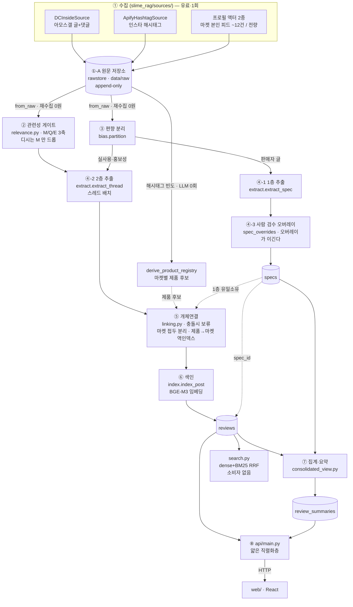
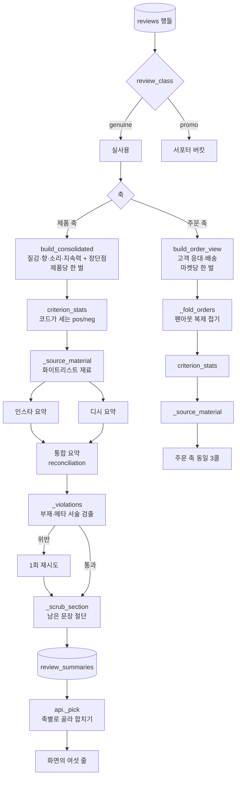

# 시스템 개요 — 전체 파이프라인과 요약 시스템

이 문서는 두 가지를 설명한다.

1. **전체 시스템** — 인스타/디시에서 글 한 줄이 들어와 화면의 카드가 되기까지.
2. **요약 시스템** — 그 중에서도 `consolidated_view.py` 가 하는 일. 이 저장소에서 가장 규칙이
   많은 부분이고, 대부분의 규칙은 "LLM 에게 부탁하지 말고 코드로 강제한다"의 사례다.

지도 성격의 문서는 따로 있다 — [ARCHITECTURE.md](../ARCHITECTURE.md)(흐름도·의존성),
[CLAUDE.md](../CLAUDE.md)(현재 상태), [MEMORY.md](../MEMORY.md)(도메인 규칙),
[docs/adr/](adr/)(결정 기록). 여기서는 **왜 이렇게 생겼는지**를 이어서 읽을 수 있게 서술한다.

---

## 0. 이 시스템이 답하려는 질문

> "이 슬라임, 실제로 어때요?"

슬라임 마켓의 후기는 두 곳에 산다. **인스타그램**(구매자가 예쁘게 찍어 올린 글 — 구조적으로 긍정
편향)과 **디시인사이드 아모스 갤러리**(익명 커뮤니티 — 구조적으로 부정 편향). 두 곳의 말은
같은 제품에 대해서도 자주 어긋난다.

이 프로젝트의 입장은 **그 어긋남을 보정하지 않는다**는 것이다. 두 출처의 점수를 평균내면
"3.5점짜리 무난한 제품"이 되어 정작 사람이 알고 싶은 정보가 사라진다. 대신
**출처별로 따로 집계하고, 갭을 그대로 보여준다**([ADR-0002](adr/0002-source-bias-first-class.md)).
소스 편향은 버그가 아니라 **1급 기능**이다.

여기에 두 개의 층을 겹친다.

| 층 | 무엇 | 출처 | 성격 |
|---|---|---|---|
| **1층 (Layer 1)** | 공식 스펙 — 향료·풀조합·종류·판매자의 질감 서술 | 마켓 본인 인스타 게시물 | 정형·객관 |
| **2층 (Layer 2)** | 사용자 후기 — 질감·향·소리·지속력·배송·응대 평가 | 인스타 해시태그 + 디시 아모스갤 | 비정형·주관 |

두 층은 `specs.id ← reviews.spec_id` 로 조인된다. "공식향은 연유향인데 후기 23건 중 8건이
비누향이라고 한다" 같은 문장은 **이 조인에서만** 나올 수 있고, LLM 이 만들 수 있는 문장이 아니다.

---

## 1. 전체 파이프라인



> 굵은 경계 하나가 이 그림에 나중에 생겼다 — **수집(유료·1회)과 처리(무료·N회)는 디스크로 갈린다.**
> 그전엔 액터 응답이 `RawReview` → LLM → DB 한 패스로 흘러 **어디에도 남지 않았고**, 추출 규칙이
> 틀렸다는 걸 나중에 알면 스크랩을 다시 사야 했다(유령 제품 복구 때 실제로 그랬다).

### ① 수집 — `slime_rag/sources/`

모든 수집기는 `Source` 인터페이스 뒤에 있고 `RawReview(text, url, platform, meta)` 를 뱉는다.
소스를 하나 추가하는 일 = `sources/` 에 파일 하나 추가하는 일이고, 하류는 안 바뀐다.

- **`DCInsideSource`** — 아모스 갤러리. **댓글도 1급 후기로 취급한다**(이 갤은 후기가 댓글에
  더 많다). 글 하나 + 그 댓글들이 한 "스레드"를 이룬다.
- **`ApifyHashtagSource`** — 인스타 해시태그. 검색어는 **제품명만** 쓴다(마켓명·'슬라임' 같은
  광역어는 노이즈만 끌어온다 — memo `hashtag-search-product-name-only`).
- **마켓 본인 계정 피드 — 액터 둘.** `business_discovery` API 가 App Review 벽에 막혀서
  ([ADR-0003](adr/0003-ig-businessdiscovery-fixture.md)) 뚫은 우회로다. 해시태그 경로와 달리
  **랭킹 편향이 없다**(피드 전체).
  - `instagram-profile-scraper` — 최신 **~12건**, `resultsLimit` 없음. 일일 top-up 용.
  - `instagram-scraper`(`directUrls`) — `resultsLimit` 를 받아 **피드 전량**을 판다.
    마켓 열거자는 `_seller_targets` **하나**를 두 수집기가 공유한다 — 복제하면 '수집은 14마켓인데
    적재는 12마켓' 같은 어긋남이 조용히 생긴다.

수집 원칙: robots·딜레이·페이지 캡. 수집한 바이트는 **git 에 커밋하지 않는다**(예외 하나 —
마켓 로고, [ADR-0010](adr/0010-market-logo-assets.md)).

### ①-A 원문 저장소 — `rawstore.py`

**가공 전 응답을 디스크에 먼저 쌓고, 그 다음에 처리한다.** `data/raw/<kind>/<key>/<UTC시각>.json`,
런당 파일 하나, **append-only**(나중의 얕은 런이 먼저 받은 깊은 캡처를 절대 못 지운다 — 그 성질이
곧 롤백이다). 봉투에 actor·requested·`scraped_at`·`usage_total_usd` 가 들어간다.
Gitignore 대상([ADR-0013](adr/0013-processing-vs-publication.md)).

| kind | 키 | 왜 그 키인가 |
|---|---|---|
| `ig_profile_feed` | 핸들 | 액터 호출 1건 = 핸들 1개 |
| `ig_hashtag` | 해시태그 | 같음 |
| `dc_thread` | **스레드 번호** | 스레드가 **비용의 단위이자 사라지는 단위**다. 수집 앵커(키워드)는 봉투의 `requested.keyword` 에 남고, 재처리는 그걸로 고른다 |

디시는 마지막까지 예외였다 — 수집이 무과금(직접 HTTP)이니 다시 받으면 된다는 논리였다. 셋 다
틀렸다: ① 이 경로의 **유료 단계는 추출**이라, 추출 규칙 한 줄 고치는 데 HTTP·robots·딜레이를 다시
밟아야 했다 · ② **갤러리는 변한다** — 지워진 글은 재수집으로 못 되찾으니 '다시 받으면 된다'가
성립하지 않는다 · ③ 재수집은 여전히 정중함 예산을 쓴다.

- 저장은 **수집기 `_run` 안**이다. 호출부로 올리면 호출부가 예외로 죽는 순간 방금 산 응답이 사라진다.
  디시 순서는 **fetch → save → build** — 셀렉터가 깨져도 그 런의 HTTP 는 안 잃는다.
- 라이브 경로와 디스크 경로는 **파서 한 벌**을 공유한다(`DCInsideSource._build_candidates` ·
  `sources.apify._post_to_seller_review`). 재처리 쪽에서 dict 를 따로 풀면 `meta` 모양이 갈려
  `bias.partition` 이 소스마다 다른 값을 받는다.
- 재처리: `ingest_dcinside(from_raw=True)`(**HTTP 0회**) · `ingest_seller_profiles(from_raw=True)`
  (**Apify $0**). 둘 다 LLM 비용만 든다.
- ⚠️ **병합 순서의 정본은 파일명이 아니라 봉투의 `scraped_at`** 이다. 개발 중 깨졌다 — 충돌
  접미사 `-2` 가 평문보다 앞서 정렬돼(`-` < `.`) 최신 캡처가 밀렸다.
- ⚠️ 디시는 **스레드당 343KB**(대부분 HTML). 172스레드 = 180MB. 전량 스윕 전에 디스크를 본다.

실측(2026-08-09 라이브 스윕): **172스레드 · 948조각 · 180MB.** 이 저장소가 찬 덕에
[ADR-0017](adr/0017-meta-only-drop-authority.md) 의 τ 스윕 8회가 **$0** 이 됐다(관련성 판정은
로컬 BGE-M3, 바이트는 이미 디스크에). 저장소가 없던 시절 그 실험은 HTTP 재수집이었다.
그리고 그 위에서 다시 유도되는 게 **제품 후보 레지스트리**다(①-C).

### ①-B 증분 수집 — 유료 단계 앞에서 자른다

같은 조각을 매 런 다시 사는 걸 막는 장치가 세 겹이다.

- **기보유 조각 컷**(`index.existing_post_ids`)은 **첫 유료 단계 앞**에 둔다. 해시태그 경로에서
  그 자리는 추출이 아니라 **`bias.partition` 앞**이다 — 거기서 먼저 도는 LLM 이 홍보성 캐스케이드라,
  추출 직전에 자르면 verdict 값을 이미 치른 뒤다. 디시는 배치 추출이라 절감 보고도 조각 수가
  아니라 `extract.count_thread_batches` 로 잰 **배치 수**다.
  절감 카운터는 `llm_calls_saved`(홍보 게이트 단락분)와 `llm_calls_saved_by_dedup` 으로 **가른다** —
  합치면 어느 절감인지 사후에 못 나눈다.
- **워터마크**(`min_thread_no`)는 디시 목록을 **상세 요청 앞**에서 자른다(HTTP 절감). 값은
  `max(thread_no) - WATERMARK_MARGIN` 이되 **수집 앵커별**이다. 갤러리 전체 최댓값으로 되돌리면
  **처음 수집하는 제품**이 남의 제품이 올려놓은 글번호를 물려받아 그 제품의 과거가 통째로 잘린다 —
  목록이 최신순이라 첫 페이지에서 끝나고, 카운트엔 '새 글 없음'과 구분되지 않는 0 만 남는다.
  앵커 이력이 없으면 워터마크 없이 전량 수집이고, 그 판단은 `counts["watermark_anchors"]` 로 드러난다.
  ⚠️ 이건 **새 글만** 아낀다. 새 댓글은 옛 글에 달리므로 재방문은 `revisit_threads` **명시 인자**다.
- **기보유 글은 문맥으로 남는다.** 그 스레드에 새 조각이 있으면 배치엔 넣고 색인만 건너뛴다
  (`counts["context_posts"]`). 빼면 배치 추출의 존재 이유 절반(형제 문맥 귀속·market 상속)을
  **증분 런에서만** 조용히 잃는다. 배치는 어차피 도니 늘어나는 건 입력 토큰뿐이다.
- ⚠️ **구조적 구멍(의도적)**: 추출 결과가 `reviews: []` 인 조각은 행을 안 남겨 매번 다시 추출된다.
  이를 막을 tombstone 원장은 하루 ~19스레드 규모에선 과투자라 안 만들었다.
- ⚠️ 관련성 게이트 예산은 **수집 중에** 쓰이므로 기보유 컷이 못 아낀다 →
  `counts["gate_unprocessed"]`(0 보다 크면 `limit` 을 올릴 신호).

`ingest_seller_profiles` 는 **원자적이지 않다**(`commit_every=25`). `from_raw=True` 의 실제 규모가
게시물 1,837건 · `extract_spec` 1,837콜(약 $3.6)이라, 커밋이 루프 끝 한 곳뿐이면 막바지 실패
하나가 이미 지불한 호출을 통째로 롤백한다(크레딧 소진 429 로 실측). 원자성을 포기해도 되는 근거는
**재실행이 이어받는다**는 것이다 — `specs` 는 `UNIQUE(market, product)` upsert 라 부분 적재가 중복
행을 안 만들고, 커밋된 게시물은 `source_permalink` 가 남아 다음 런의 컷이 건너뛴다.

### ①-C 제품 후보 레지스트리 — 빈도가 가르는 것

`derive_product_registry`(**LLM 0회**)는 피드 전량의 해시태그를 마켓별로 집계해
`data/product_registry.json` 을 만든다. 해시태그 규칙만으로는 `#꼼픽`(개인 태그)과 `#빠코볼`(제품)을
**원리적으로 못 가른다** — 둘 다 그냥 고유 태그다. 갈라 주는 새 신호는 **빈도**다: 개인·마켓 태그는
거의 전 게시물에, 제품 태그는 몇 건에만 붙는다. 12건 창에서는 **계산 자체가 불가능했던** 신호이고,
이게 피드 전량 수집의 나머지 절반이다.

- **고빈도 태그를 자동 배제하지 않는다** — `market_tag_candidates` 로 분리만 하고 승격은 사람이 한다.
  과잉 배제는 진짜 인기 제품을 지우는데, 그 손실은 **화면에 안 보인다**(유령 제품과 반대 방향의,
  더 알아채기 어려운 실패다). 표본이 작으면(<8건) 비율을 근거로 쓰지 않는다.
- 파일엔 이름·건수·날짜·permalink 만 담고 **캡션 본문은 안 담는다** → 그래서 커밋된다(ADR-0013).
- **KB `products[]` 에 쓰지 않는다.** 저 칸은 1층 스펙 객체를 담는 자리라, 이름만 있는 항목은
  `_PRODUCTHOOD_FIELDS` 가 전부 null 이라 제품성 미달로 버려지는 바로 그 모양이 된다.

실측: 제품명 **2,372개** 중 **2,349개가 정확히 한 마켓에만** 속한다. 이 유일소유가 ⑤ 개체연결의 두 기능
(제품명 복구 2단 타이브레이크 · 제품→마켓 역인덱스)의 재료다.

### ② 관련성 게이트 — `relevance.py`

수집한 글이 "우리가 찾는 타깃에 관한 것"인지 판정한다. **LLM 을 쓰지 않는다** — 색인용으로
이미 로드한 BGE-M3 임베딩을 재사용해 추가 비용이 0이다.

- **Axis 1 (topic)** — 타깃 앵커("봄 허니푸냥이 슬라임")와 **청크 최대 코사인**. 전체글 임베딩을
  쓰면 한 줄짜리 신호가 희석되므로 문장 단위로 끊어 최댓값을 본다.
- **Axis 2 (M/Q/E)** — 독립 이진 3축([ADR-0006](adr/0006-mqe-three-axis-relevance.md)).
  배타적 4분류를 쓰던 시절 centroid 가 붕괴한 것이 교체 이유다.
  - `M` (갤 메타·드라마·뉴스) — **유일한 DROP 사유**
  - `Q` (질문 화행) — **순수 관측 축.** 정렬 키에 들어가지 않는다
  - `E` (1인칭 실사용 평가) — 순위의 주 신호. 규칙 캐스케이드 ∪ 로지스틱 프로브
- **하드게이트** — 부정 감성 항목은 `E=0` 이어도 `bias_hold` 로 후보에 남는다. 부정 후기 1건을
  잃는 손해가 헛호출 10회보다 비싸다. 소스 편향이 조용히 깎이는 걸 막는 자리다.
- 예산을 넘긴 항목은 **드롭이 아니라 `unprocessed`** 로 센다. 침묵 절단 금지.

판정 전문은 `reviews.relevance_meta` JSONB 에 저장된다(하드게이트 #3 — 실패 추적).

#### 드롭 권한은 축마다 다르다 — ADR-0017

문서는 오래전부터 `M` 이 유일한 드롭 사유라고 적어 왔는데 **코드는 아니었다.** 원문 저장소가
차면서 그 격차를 처음으로 **무과금 측정**할 수 있게 됐다(τ 스윕, 948조각, LLM 0회):

```
     τ   topic 통과   M 드롭   e_union 드롭    KEEP
  0.35        842       5          461        376
  0.45        515       4          281        230   ← 당시 운용값
  0.55        267       0          141        126
```

**`M` 이 지운 건 4건이다.** 같은 판정에서 `topic` 이 433건, `e_union` 이 281건 — 드롭 권한이
문서상 유일하게 있는 축이 사실상 아무 일도 안 하고, 나머지 둘이 코퍼스의 76%를 지우고 있었다.
두 축은 성격이 다르다:

- **`e_union` 은 계약 위반**이었다(ADR-0007 이 divergence D2 로 기록해 둔 것). 고쳤다.
- **`topic` 은 설계된 동작**이었다. 그래서 이건 **설계 변경**이다. 근거는 규칙이 아니라 **재료** —
  이 갤은 초성(`ㅂㅇㅍ`)과 생략 지시("이거", "얘")로 제품을 부르는데 임베딩 앵커는 제품 풀네임이다.
  앵커 품질 문제가 아니라는 것도 측정됐다: **가장 구체적인** 앵커 `ㅈㄴ 아몬드바나나브레드` 의
  keep 율이 **13.0%** 로 오히려 가장 낮았다. τ 를 올려 나아지는 종류의 손실이 아니다.
- **비용은 제약이 아니었다.** 스레드 배치라 조각이 5배여도 호출은 2배가 안 된다 —
  175조각 $0.11 vs 877조각 **$0.51**. "엄격하게 걸러 아낀다"는 40센트짜리 논거였다.

강제 장치는 `RELEVANCE_CONF` 의 **`drop_axes`** — 그 플랫폼에서 드롭 권한을 가진 축 목록이고
디시는 `("meta",)` 다. 목록 밖 축은 **판정을 계속 계산·기록하되 버리지 않는다**(순위·사후 분석용).
기본값 `DROP_AXES_DEFAULT` 는 전 축이라 **명시하지 않은 플랫폼은 예전 그대로** — 인스타는 무변경이다
(거긴 `domain` centroid 가 name-collision 방어의 본체다).

> **되돌리는 법이 행에 남아 있다.** 살아남은 이유를 `relevance_meta.below_tau`(τ 미만인데 생존) ·
> `.low_e`(E 합집합 음성인데 생존)로 적는다. 드롭 카운터와 **합치지 않는다** — 합치면 '걸러냈다'와
> '규칙상 안 거른다'가 한 숫자가 되어 늘어난 행의 출처를 사후에 못 가른다.
> ⚠️ 게이트가 느슨해지면 **스레드당 조각 수**가 늘어난다. 그게 배치 경계 버그를 처음으로 깨웠다(§④).

### ③ 편향 분리 — `bias.py`

인스타 수집물에는 세 종류가 섞인다.

```
판매자 글  → 1층 스펙으로 라우팅   (KB 핸들 역인덱스, 결정적)
홍보성 후기 → review_class='promo'  (별도 버킷 — 드롭 아님)
실사용 후기 → review_class='genuine'
```

홍보성 판정은 **게이트 → LLM 캐스케이드**다([ADR-0004](adr/0004-promo-gate-llm-cascade.md)).
값싼 키워드 게이트가 recall 을 담당해 "홍보 의심"만 통과시키고, precision 은 LLM 이 맡는다.
명백한 실사용은 게이트에서 즉시 단락 → LLM 호출이 5~10× 줄어든다.

도메인 규칙이 여기 박혀 있다: **할인·서비스·비매품은 구매 맥락이지 홍보가 아니고**,
**서포터·체험단·협찬만 홍보다**(memo `promo-vs-purchase-domain-rules`). 그래서 "서포터분들은
얄랑하다 했지만 제가 만졌을 땐 매트했어요"는 genuine 이다 — 남을 인용했을 뿐이니까.

### ④ 추출 — `extract.py`

비정형 텍스트 → 정형 JSON. 결정성은 temperature 가 아니라 **structured outputs(strict)** 로
확보한다(GPT-5 계열은 추론 모델이라 temperature 를 무시/제한한다).

**1층** (`extract_spec`) — 판매자 캡션 → `{product, scent, base_combo, slime_type,
official_texture, beads}`. 결정적 게이트 둘이 LLM 판정 위에 얹힌다:

- 캡션에 제품 고유 해시태그가 없으면 → **통째로 스킵**(비매품·공지글이다).
- 제품명은 반드시 **그 캡션의 해시태그**여야 한다 → LLM 이 향료·재료어를 제품명으로 지어내도
  드롭. 이 게이트가 후기 경로에 없던 시절 인스타 80행 중 상당수가 유령 제품이었다
  (memo `phantom-products-from-review-path`). 복구 규칙은 `resolve_product_name` 한 벌이고
  (①캡션 해시태그는 `specs` 에 없어도 유지 · ②단독 후보면 교체 · ③1층 일치가 정확히 하나면
  타이브레이크 · ③′그게 0건일 때만 레지스트리 · ④아니면 보류), 백필과 수집이 이걸 공유한다.
  ⚠️ **두 집합을 합집합으로 합치지 말 것** — 1층에서 정확히 하나이던 판정이 레지스트리 후보가
  끼어들어 보류로 **퇴화**한다. 있던 판정이 사라지는 방향이라 화면엔 '제품 없는 후기'로만 보인다.

**④-3 사람 검수 오버레이 — 안 채워지는 칸이 있다** ([ADR-0016](adr/0016-human-in-the-loop-spec-review.md))

1급 규칙('미언급 → null, 지어내기 금지')엔 필연적 귀결이 있다. 판매자가 캡션에 재료·향·종류·질감을
안 썼으면 그 칸은 **영원히 NULL** 이다 — LLM 을 더 돌려서 되는 일이 아니라 **입력의 부재**다.
실측(2026-08-09, `specs` 408행 시점): 네 칸 중 하나 이상이 NULL 인 행이 **39개**.

- `spec_overrides.py` 는 순수 정책(DB·네트워크·LLM 무의존), `data/spec_overrides.json` 이 커밋되는
  오버레이다(`data/product_aliases.json` 과 같은 가족).
- **DB 에 두면 안 된다** — `specs` 는 파생 테이블이라 `setup(reset=True)` 한 번에 손으로 채운 값이
  날아간다. 복원은 `setup` 꼬리의 `apply_spec_overrides()`.
- **오버레이가 이기는 자리는 `pipeline._upsert_spec` 한 곳**이다. 그 함수는 전 칸이
  `COALESCE(EXCLUDED.x, specs.x)` 라 **들어오는 non-null 이 기존 값을 덮는다** — 마스킹이 없으면
  다음 수집이 사람의 검수를 조용히 되돌린다. 프로필 액터가 최신 ~12글만 주므로 같은 제품이 여러
  글에 걸쳐 다시 잡히는 건 **정상**이라, 이건 이론적 위험이 아니라 예정된 사고다.
  **읽기 시점(`consolidated_for`·`list_products`·`/api/page`)에 얹지 말 것** — 읽는 곳이 넷을 넘고
  하나만 빠뜨리면 화면과 요약 프롬프트가 서로 다른 스펙을 본다.
- `unknown` 은 **큐가 0 에 닿게 하려고** 있다 — "사람이 봤는데 모르겠다". 값을 만들지 않고
  (DB 는 NULL 유지) 큐에서만 뺀다.
- 화면은 `web/src/screens/SpecReview.tsx`(`/review`)이고 **픽셀 대조 계약 밖·로컬 전용**이다.
  `/api/admin/*` 는 `ADMIN_ENABLED=1` 없이는 **등록조차 안 되어 404**다.

**2층** (`extract_thread`) — 후기 → `{market, shipping_cs, reviews[], flags}`.
구조가 두 층인 게 핵심이다([ADR-0005](adr/0005-review-vs-product-unit.md)):

```
market · shipping_cs   ← 후기(주문) 단위 사실. 보통 1주문 = 1마켓
reviews[]              ← 제품 단위 평가. 비교글이면 제품 수만큼
```

네 개의 하드닝이 붙어 있다.

- **전언(hearsay) 차단** — "친구가 샀는데 걀걀거림 심하다고 함"은 가짜 부정 후기가 된다. 프롬프트
  지시만으로는 못 막는다(같은 입력 4회 호출에 4번 다른 답). 그래서 `firsthand_evidence` 를
  **필수 필드**로 요구하고, `drop_hearsay_reviews` 가 **다섯 겹**으로 검사해 코드로 버린다:
  ①근거 없음 ②근거가 원문에 실재하지 않음(지어낸 인용) ③근거 조각이 전언 표지를 담음
  ④**구매 예정 표지**(`담았는데 우뗘??` 한 조각이 사지도 않은 제품 6행을 냈다)
  ⑤**제품명 반복** — `firsthand_evidence='바질토마토블렌디드'` 는 제품명을 다시 적은 것이지
  써 봤다는 근거가 아닌데, 제품명은 당연히 원문에 있고 전언·구매예정 표지와도 무관해서 **앞의 네
  겹을 전부 통과한다**(실측 30행).
  ⚠️ 다섯째 겹의 기준은 **길이지 포함 여부가 아니다**(`_EVIDENCE_MIN_RESIDUE = 1`) —
  `새튀반 좋았고` 는 정상 근거이고 '제품명+4자 이내'가 116행이다. **2로 올리면** 1음절 평점
  (`잭두콩 썸`·`핑키별 쏘쏘`)의 잔여가 정확히 1자라 8행이 통째로 죽는다.
  ⚠️ ④는 **관련성 축이 아니다.** 게이트가 이걸로 조각을 버리면 첨삭 스레드가 후보에서 빠지는데,
  거기 달린 **댓글**엔 남이 쓴 진짜 후기가 있다.
- **스레드 배치** — 호출당 입력 토큰의 **99.4%가 고정 프롬프트**였다(실측). 비용 레버는 분류
  정확도가 아니라 호출 단위다. 그래서 글+댓글을 `[S0] [S1] …` 로 번호 매겨 한 번에 보낸다.
  배치 크기 12는 캐시 하드스탑 실측치다(`Settings.max_thread_sources`).
  부수 이득: 형제 댓글이 같은 호출 안에 있어 **제품명을 생략한 댓글의 귀속**이 가능해졌다.
  - ⚠️ `THREAD_MAX_TOKENS`(16,384)로 부른다 — 기본 4,096으론 **모자란다.** GPT-5 계열의
    `max_completion_tokens` 는 **추론 토큰까지 포함**이라 본문 전에 예산이 마르고 JSON 이 문자열
    중간에서 잘린다. 파싱 재시도 1회는 같은 지점에서 똑같이 잘려 무의미하다. 실측(2026-08-09 유료
    런): 34앵커 중 **2앵커가 통째로 죽었다**(74조각 유실 · 복구 $0.15).
  - **배치 하나의 실패는 그 배치만 잃는다**(예외 전파 금지). 빈 문서로 자리를 채워 정렬을 지키고
    (짧은 리스트는 zip 이 조용히 잘라 뒤쪽 귀속을 민다), 행이 안 남으니 **다음 런이 공짜로
    재시도**한다 — 원문이 디스크에 있는 값어치가 정확히 이것이다.
  - 배치 크기를 넘는 스레드는 청크가 갈리는데 **글 본문은 `members[0]` 하나뿐**이라 둘째 청크부터
    글이 빠진다. 그래서 이어지는 청크마다 글 본문을 **문맥으로만** 앞에 붙이고 그 문서는 버린다
    (호출 수 불변, 입력 토큰만 증가). ⚠️ 이 분기는 ADR-0017 **전까지 한 번도 안 돌았다** — 예전
    게이트는 스레드당 9조각까지만 통과시켰다. M-only 로 바꾸자 10스레드가 12를 넘었다.
- **제품 어휘 머리말** — 디시 추출 프롬프트는 `[제품 후보]` 를 머리말로 받는다.
  **왜 linking 으론 안 되나:** linking 은 모델이 **이미 뽑은 것만** 정규화한다. 댓글이
  `ㅇㅇㅈ 아바 좋더라` 면 모델이 먼저 '아바'를 제품으로 **인식**해야 정규화할 대상이 생긴다 —
  인식 실패는 사후 정규화로 못 되살린다. 실측: 디시 신규 조각의 **44%** 가 초성 토큰을 포함한다.
  ⚠️ 제품 **초성은 생성하지 않는다**(실측 오탐 9/14 — 웃음 런·욕설·타제품 초성과 충돌).
  ⚠️ 어휘를 통째로 싣지 않는다 — 1급 규칙과 정면으로 닿는다. `vocab_candidates` 가 **그 스레드
  본문에 등장한 표면형만** 남기므로 목록의 모든 이름은 텍스트에 근거가 있다(부수 효과로 토큰도
  준다 — 마켓당 160여 개 대신 중앙값 2개). 그래도 강제는 코드다(`enforce_product_vocab` 사후 재검사).
  근거 스코프는 **스레드**다(조각 아님) — 제품명을 생략한 댓글은 자기 텍스트에 이름이 없는 게 정상이라,
  조각으로 좁히면 그 기능이 통째로 죽는다.
- **비제품 이름 게이트 둘** (2026-08-10) — 추출기가 제품이 아닌 말을 제품명으로 들어올린다.
  이름만 비우고 **행은 남긴다**(1급 규칙은 '미언급 → null' 이지 드롭이 아니고, 그 조각의 배송·CS 는
  마켓 축에 남아야 한다).

  | 함수 | 대상 | 실측 |
  |---|---|---|
  | `is_non_product_label` | 판매 **형식** — `비매품 1번`·`이번차수` | 11행 / 8개 이름 |
  | `is_non_product_word` | 종류어·재료어·조각난 이름 — `디폼`·`글루올`·`캔디어쩌구`·`ㅅㄱㄷ` | 12+8+5+6행 |

  ⚠️ **부분일치로 만들면 안 된다.** 라벨 쪽 반례가 둘 다 실재한다: ① `나비매듭`·`말차수플레` 처럼
  진짜 제품명이 라벨어를 품는다 · ② **`연찌비매17`·`푸딩비매품`·`웨이즈1월비매` 는 1층 `specs` 에
  실재하는 제품**이다(64행 — 연찌·웨이즈는 비매품에 번호를 붙여 해시태그로 판다). 부분일치였으면
  그 제품들이 통째로 사라졌고, **그 손실은 화면에 안 보인다**(유령 제품과 반대 방향).
  그래서 **맨몸 라벨**은 무조건, **수식된 라벨**은 1층/레지스트리가 모르는 이름일 때만 지운다 —
  증거를 안 주면 아무것도 안 지운다(페일세이프). 단어 쪽도 같다: `specs` 제품명 1,980개 중 그
  단어와 **완전히 같은** 이름은 0개인데 **품은** 이름은 16개다(`내리꽃디폼`·`베이직우드폼`…).
  ⚠️ 라벨 게이트의 자리는 **해시태그 게이트 앞**이다 — `repair_product_names` 는 태그가 없으면 즉시
  반환하므로, 뒤에 두면 디시엔 아예 안 돈다(그래서 `비매품 1번` 이 살아남았다).

### ⑤ 개체연결 — `linking.py`

`mentioned_market`("ㅂㅉ") → 정규 `market_word`("빈짱"). KB 명부의 표면형(상호·표시어·핸들·별칭)과
**초성** 역인덱스로 결정적 매칭한다. `linking` 은 **DB 무의존**을 유지한다(게이트:
`test_linking_stays_db_free`) — 1층 쌍이 필요하면 `pipeline` 이 주입한다.

원칙은 **보류(abstain)** 다. 초성이 충돌하면 확신도를 나눠 임계 미만이면 `market=NULL` 로 둔다.
**틀린 귀속 < 결과 없음** — 이 저장소 전체를 관통하는 규칙이다.
(현재 KB 14마켓엔 **초성 충돌이 없다**. 다만 별칭은 초성으로 환원되지 않아 `ㅅㅈㄴ`(=슬지나=지나)
같은 표기는 스캔에 안 잡힌다.)

실측: 아모스갤 '빠코볼' 25건 중 원문 17조각의 **10개가 마켓을 아예 언급하지 않았다**. 등장한
`ㅈㄴ` 6건도 대부분 마켓이 아니라 부사 '존나'였다. 그래서 조회 API 는 마켓을 **선택**으로 받는다.

그런데 그 보류가 **너무 많이 쌓였다**. 아모스갤 801행 전수 검수(2026-08-10, `data/raw/dc_thread`
파싱본 ↔ 추출행 1:1 대조, **LLM·HTTP 0회**)가 낸 결과가 아래 네 절의 출발점이다.

| 코드 | 결함 | 행 |
|---|---|---|
| `D1` | 스레드 상속이 원문의 명시 마켓을 **덮음** | 19 |
| `D2` | 1층 소유 마켓과 배정 마켓 불일치 | 18 |
| `D3` | KB 미등재 마켓(초성) → 귀속 불가 | 105 |
| `D5` | 종류어·재료어·커뮤니티어를 제품명으로 | 47 |
| `D6` | 약칭·오타·조사 결합 → 정본 미매칭 | 54 |
| `D7` | 마켓 표기가 제품명에 남음 | 4 |
| `F1` | 마켓을 **채울 수 있는데** 비어 있음 | 78 |

#### ⑤-1 마켓 접두는 떼고 마켓으로 승격한다 — `split_market_prefix`

추출 프롬프트는 '제품명에 마켓 초성을 섞지 마라'고 **말만** 하고 강제가 없었다. 실측 813행에서
맨몸 마켓 표기 21행 + `마켓+제품명` 11행. 그 이름으론 `specs` 조인도, 같은 제품의 다른 조각과의
집계도 영영 안 된다.

- ⚠️ **완성형 음절을 초성으로 환원하지 않는다**(`_market_token`). 허용하면 `포도`→푸딩(ㅍㄷ) ·
  `배`→봄(ㅂ) · `육쩐`→연찌(ㅇㅉ)로 **멀쩡한 제품명이 마켓 접두로 잘린다.** 인정하는 건
  ①표면형 완전일치 ②**자모만으로 된 토큰**의 KB 초성 일치, 둘뿐이다.
- 마켓 근거는 **좁은 것부터** 본다: ①항목 자신(`reviews[].mentioned_market`) ②제품명 접두
  ③글/스레드 값. ③을 앞에 두면 스레드 상속이 항목 자신의 표기를 이긴다(= D1 재발).
- ⚠️ **접두 분리와 비제품 단어 게이트는 합성 순서가 틀리면 조용히 반대로 동작한다** — 실측으로
  양방향 다 재현됐다: ①단어 게이트가 먼저면 `ㅇㅊ` 가 '자모뿐인 이름'으로 비워져 **마켓 신호가
  사라지고**, 그 행은 스레드 도장 마켓을 0.95(직접 매칭)로 물려받는다(되돌릴 표식 없는 오귀속 —
  NULL 보다 나쁘다) · ②반대로 `ㅂㅇㅍ 빨대` 의 나머지 `빨대`는 게이트를 이미 지나쳐 제품으로 남는다.
  그래서 `extract_thread` 는 단어 게이트를 **부르지 않는다**(추출 층엔 KB 가 없어 접두를 못 뗀다).
  합성은 KB 를 아는 두 곳에서만 이 순서로 돈다: `linking.link` · `pipeline.dc_attribution_target`.
  게이트: `test_extract_to_link_composition_*` — `link` 와 `split_market_prefix` 를 **따로** 보는
  테스트는 이 결함이 살아 있어도 전부 통과한다.

#### ⑤-2 스레드 상속은 채우기 전용이고, 출처는 글 본문 하나뿐이다

- **덮어쓰기 금지** — 자기 마켓을 뽑은 조각은 그대로 두고, 마켓을 말하지 않은 형제에게만 물려준다.
  덮어쓰던 시절 **36행이 자기 본문과 모순**됐다(스레드 200743: 본문에 마켓이 7개인데 `빈짱` 하나가
  19행 전부에 찍혔다). ⚠️ 상속 **자체**를 없애면 안 된다 — 마켓을 안 밝힌 댓글은 여전히 글의 값을
  받아야 개체연결이 선다.
- **댓글에서 상속하지 않는다** — 예전엔 글이 마켓을 안 밝히면 아무 댓글의 마켓이나 집어 스레드
  전체에 물려줬다. 댓글의 마켓은 **그 댓글 작성자의 것**이지 스레드의 것이 아니다. 실측: `빈짱`
  21행 중 **19행이 한 스레드**에서 나왔고 출처는 댓글 하나의 `ㅂㅉ` 였다. 마켓이 붙은 스레드가
  **95/95(100%) 단일 마켓**이었는데, 이 갤의 지배적 형태는 한 글에 여러 마켓이 나열되는 추천·첨삭
  글이다 — 100%는 나올 수 없는 값이라 그 자체가 증거였다.
- 상속 건수는 `counts["market_inherited"]` 로 드러낸다(무음 금지).

#### ⑤-3 제품명이 마켓을 함의한다 — 제품→마켓 역인덱스

`consolidated_for(market, product)` 는 두 키를 **모두** 요구하는데, 디시 후기 813행 중
**365행(45%)이 `market IS NULL`** 이었다. 추출 실패가 아니라 **원문에 마켓이 없는 것**이고,
결과는 화면에 '후기 없음'으로만 보이는 **조용한 손실**이다. 그런데 제품명 2,372개 중 2,349개가
정확히 한 마켓 소유다(①-C).

- `build_market_inversion` 은 **두 층을 끝까지 갈라** 만든다(`.spec` / `.registry`).
  ⚠️ **합집합 금지** — 1층에서 정확히 하나이던 판정이 레지스트리 후보 때문에 다중소유(=보류)로
  **퇴화**한다. 1층이 그 이름을 **알기만 하면**(모호해도) 레지스트리로 내려가지 않는다.
- ⚠️ **발동 조건이 좁다**: `mentioned_market` 이 **애초에 비어 있던** 경우만이다. 원문이 마켓을
  말했는데 초성 충돌로 보류된 행은 **건드리지 않는다** — 거긴 증거가 갈렸다는 뜻이고, 제품명이
  개체연결의 보류를 뒤집을 권한은 없다.
- 인덱스는 **유료 호출 앞에서 런당 한 번**만 만든다. 조각마다 만들면 같은 이름이 조각마다 다른
  마켓을 받아 귀속이 **수집 순서에 의존**한다.
- **검수는 permalink 를 브라우저로 여는 일이 아니다.** `market_inversion_review()` 가 판단 재료를
  디스크에서 모아 준다(LLM·HTTP 0회): ①그 태그가 실제로 그 마켓 피드에 붙어 있었나 ②**다른 마켓
  피드에도 있나**(있으면 유일소유가 깨진 것) ③이 마켓이 붙을 후기 본문이 무슨 얘기를 하나.
  통과분도 근거를 남긴다 — 안 남기면 다음 사람이 같은 검수를 다시 한다.
  실측 1회차(레지스트리 5개): **4 통과 · 1 탈락.** 탈락한 `디폼클리어` 는 제품명이 아니라
  **종류어**였다. ⚠️ 반환값에 **캡션 발췌가 들어간다** — 터미널에서 읽는 처리 단계이지 산출물이
  아니다(파일로 커밋 금지, ADR-0013).

#### ⑤-4 확신도는 provenance 표식이자 **롤백의 유일한 열쇠**다

마켓 칸을 채우는 경로가 여럿이고, 값이 같으면 **어느 경로가 채웠는지 사후에 못 가른다.**
그래서 경로마다 전용 상수를 쓴다 — 9개 값이 **전부 고유**여야 한다(게이트:
`test_fill_path_confidences_never_collide`).

| 경로 | 상수 | 값 |
|---|---|---|
| 직접 매칭(표면형 / 초성) | — | 0.95 / 0.85 |
| 제품명 접두 승격 | `PREFIX_CONF_SURFACE` / `_CHOSEONG` | 0.92 / 0.82 |
| 스레드 상속 | `INHERIT_CONF` | 0.75 |
| 제품→마켓 역인덱스 | `INVERSION_CONF_SPEC` / `_REGISTRY` | 0.80 / 0.65 |
| 적재분 백필 | `BACKFILL_CONF_SPEC` / `_CAPTION` | 0.90 / 0.70 |

전부 `link_abstain_threshold`(0.6)보다 **높다** — 아래로 내리면 '채웠는데 확신도는 보류선 아래'가
된다. 레지스트리가 가장 낮은 이유는 그게 사람이 승격한 목록이 아니라 **유도된 후보**라서다:
**잡음 층만 골라 되돌릴 수 있어야** 이 기능을 켤 수 있다. 사람 판단 오버레이는
`data/market_inversion_excludes.json`(스펙 오버레이·별칭 사전과 같은 가족).

> ⚠️ 이 숫자들은 provenance 표식이지 **티어 정렬 키가 아니다.** 어느 근거가 이기는지는 `link()` 의
> 분기 순서가 정한다. 예전엔 상속분이 직접 매칭과 **바이트 단위로 같아서**(0.85) 오귀속이 드러나도
> 행을 골라낼 수 없었다 — 확신도 0.0 을 그대로 둬서 '마켓은 있는데 확신도 0'인 모순 행이 **273건**
> 남았던 시절도 있다.

#### ⑤-5 이미 적재된 행은 별도 함수가 제자리 복구한다

색인은 `ON CONFLICT DO NOTHING` 멱등이라 **재수집으로는 기존 행이 안 바뀐다.** 그래서 복구는 전부
별도 함수이고, 전부 **LLM 0회 · `dry_run=True` 기본**이다(재임베딩은 로컬 BGE-M3라 무과금).

| 함수 | 하는 일 |
|---|---|
| `repair_dc_attribution` | 접두 분리 + 비제품 게이트를 적재분에 제자리 적용(판정 정본은 순수 함수 `dc_attribution_target`) |
| `backfill_review_markets` | 1층 유일소유로 빈 마켓 채움 |
| `backfill_market_from_product` | 역인덱스로 빈 마켓 채움 |
| `backfill_non_product_labels` | 비제품 라벨 이름만 비움 (**실행 완료** — 11행 / 8개 이름, 행 삭제 0) |
| `backfill_market_confidence` | 확신도 0 유산에 근거를 **재도출**해 메움 (엇갈리면 **안 건드림**) |
| `repair_evidence_headers` | 마켓을 나중에 채워 `evidence` 가 `[마켓미상 …]` 인 행 재렌더(27→0) |

- `render_review` 가 마켓을 검색 텍스트에 **굽기** 때문에 마켓을 고치면 `evidence`·`tokens`·
  `embedding` 셋을 **함께** 다시 만든다.
- 두 백필은 겹치지 않지만(둘 다 `market IS NULL` 만 본다) **실행 순서가 표식을 정한다** — 먼저 도는
  쪽의 확신도가 그 행에 남는다. 실측: `backfill_review_markets` 가 1층 101행을 먼저 채워
  `backfill_market_from_product(tier="spec")` 의 대상은 0이 됐고, 남은 건 레지스트리 6행이다.
  경과 `market IS NULL AND product IS NOT NULL` **312 → 208**.
- 원문이 **다른 마켓**을 가리키면 채우지 않고 `conflict_list` 로 사람에게 넘긴다. 두 백필이 같은
  칸을 쓰므로 **충돌 규칙이 같아야** 한다 — 다르면 어느 쪽이 먼저 도느냐로 결과가 갈린다.
- ⚠️ 그렇다고 `backfill_review_markets` 에 '본문이 다른 마켓을 말했으면 채우지 마라' 가드를 넣진
  않는다(넣었다 되돌렸다). 비교글은 마켓이 여럿 나오는 게 정상이고 그중 하나를 제품명으로만
  가리키는 것도 정상이라, 실측 3건이 전부 **맞는 채움**인데 막혔다.
- **보류(제품명 None) 항목은 내용이 완전히 같을 때만 접는다.** 이름이 없어
  `UNIQUE(source, post_id, product)` 가 못 거른다(Postgres 는 NULL 을 서로 다른 값으로 본다).
  ⚠️ 내용이 다른 보류분을 접으면 서로 다른 제품일 수 있는 후기가 한 건으로 사라진다.
- **제품명 포함관계는 자동으로 접지 않는다** — `product_containment_candidates` 가 후보만 뽑고
  승격은 사람이 `data/product_aliases.json` 에서 한다. 같은 조각의 `빠코볼`/`미니빠코볼` 은
  **진짜 다른 제품**이고(실측), 과잉 병합의 손실은 화면에 안 보인다(빈칸이 안 생긴다).
  실측 5쌍 → 접두 분리 뒤 **3쌍**으로 줄었다(②를 고치면 ③이 대부분 자동 해소된다는 예측이 값으로
  확인된 자리).

무과금 감사는 `evals/audit_attribution.py`(읽기 전용)가 상시로 돈다.

### ⑥ 색인 — `index.py`

**청킹 단위 = 제품 항목 1개 = 1행.** 비교글 하나는 제품 수만큼 행으로 팬아웃된다.

- 임베딩 대상은 원문이 아니라 **구조화 필드로 만든 렌더링 텍스트**
  (`[빈짱 한글과자한줌] / 향: 연유향 좋음 / 질감: 말랑 좋음 …`). 추출 항목 단위로 끊겨 있어
  청크 경계가 명확하기 때문이다. 원문 전문은 ADR-0013 이후 별도 컬럼에 함께 보관한다.
- BGE-M3 dense(1024차원) + kiwipiepy 형태소 토큰(BM25용)을 같이 넣는다.
- **팬아웃 복제** — `shipping_cs`·`relevance_meta`·`source_ref` 는 조각 단위 속성인데 행은
  제품 단위라, 제품별 행마다 **복제**된다. 이 복제가 나중에 요약의 가장 큰 함정이 된다(§2.2).
- **멱등성은 DB 제약이 갖는다** — `UNIQUE(source, post_id, product)` + `ON CONFLICT DO NOTHING`.
  주석만 '멱등'이라 주장하던 시절, 배치를 두 번 돌려 인스타 80행 중 28행이 중복이었다. 단순
  중복이 아니라 **같은 글이 런마다 다른 감성으로 추출돼**(LLM 비결정성) 독립 후기 두 건처럼
  집계에 들어갔다 — 그대로 편향 집계 오염이다.
  `DO UPDATE` 로 바꾸면 안 된다: 재수집마다 이미 내려진 판정을 조용히 덮어쓴다.

### ⑦ 집계·요약 — `consolidated_view.py`

**이 문서의 §2 전체.**

### ⑧ 표시 — `api/` → `web/`

- `api/main.py` 는 **얇다.** SQL·표시 정책·집계는 전부 `slime_rag` 안에 있고, 여기서 하는 일은
  `pipeline` 호출과 JSON 직렬화뿐이다. 로직이 여기서 자라면 백엔드가 두 벌이 된다.
- `/api/page` 는 **저장된 요약만 읽는다**(`with_summary=False`). 페이지 로드마다 LLM 을 부르면
  방문마다 과금된다.
- 화면에 나가는 본문은 **서버에서 자른 발췌**다([ADR-0013](adr/0013-processing-vs-publication.md)).
  저장·처리는 허용, 제한은 **표시**에만 걸린다. CSS `line-clamp` 는 발췌가 아니다 — 전문이 이미
  브라우저에 도달했으니까. 자르는 자리는 `pipeline.list_reviews` **한 곳**이다.
- 화면은 둘이다. `SlimeSearch.tsx` 는 디자인 HTML 을 그대로 옮긴 **픽셀 대조 계약** 안에 있고,
  `SpecReview.tsx`(`/review`)는 그 **밖·로컬 전용**이다 — `ADMIN_ENABLED=1` 없이는 `/api/admin/*`
  가 등록조차 안 되어 404이고, CORS 쓰기 메서드도 같은 게이트를 따른다.
- `platform` 에 모르는 값을 주면 **예외**다. 예전엔 조용히 필터가 꺼져 '아모스갤만' 요청에
  인스타가 섞여 나왔다 — 소스 미평균(1급 규칙)이 조용히 깨지는 경로였다.

---

## 2. 요약 시스템

여기부터가 본론이다. 입력은 `reviews` 테이블의 행들, 출력은 화면의 여섯 줄이다.



### 2.1 왜 축이 둘인가 — 요약의 가장 중요한 구조

여섯 개 기준은 **한 리스트**에 산다. `consolidated_view.CRITERIA` 하나가 DB 스키마, 여섯 개
프롬프트, 화면의 표를 **동시에** 정의한다([ADR-0011](adr/0011-six-criteria-summary-and-search-page.md)).

```python
CRITERIA = [
    {"key": "texture",   "ko": "질감",      "scope": "product"},
    {"key": "scent",     "ko": "향",        "scope": "product"},
    {"key": "sound",     "ko": "소리",      "scope": "product"},
    {"key": "longevity", "ko": "지속력",    "scope": "product"},
    {"key": "cs",        "ko": "고객 응대", "scope": "market"},
    {"key": "shipping",  "ko": "배송",      "scope": "market"},
]
```

`scope` 가 최근에 붙었다([ADR-0015](adr/0015-market-scope-order-criteria.md)). 이유:

`shipping_cs` 는 **원래부터 주문 단위 필드**였다(ADR-0005). 그게 제품 행에 실려 있는 건
`index_post` 가 팬아웃마다 **복제**했기 때문이지 제품의 속성이라서가 아니다. 그런데 요약을
제품별로 돌리면:

- 비교글 하나의 배송 불만이 그 글이 언급한 **모든 제품의 요약**에 각각 관측된 것처럼 실린다.
- 같은 마켓의 제품 페이지들이 결국 **같은 두 문장을 반복**한다.
- 비용도 제품 수만큼 든다.

이건 표시 문제가 아니라 **귀속(attribution) 오류**다. 그래서 요약이 둘로 갈렸다.

| | 제품 축 | 주문 축 |
|---|---|---|
| 함수 | `build_consolidated` | `build_order_view` |
| 기준 | 질감·향·소리·지속력 | 고객 응대·배송 |
| 장단점 | 있음 | **없음** (한 화면에 목록 둘이면 어느 걸 읽어야 할지 모른다) |
| 단위 | 제품당 한 벌 | **마켓당 한 벌** |
| 저장 행 | `product IS NOT NULL` | `product IS NULL` |
| 생성 | `pipeline.generate_summaries(market, product)` | `pipeline.generate_market_summaries(market)` |

화면은 여전히 여섯 줄을 보여준다 — 마켓 축 두 줄을 **빌려 와서** `'이 마켓 전체 주문 기준이에요'`
라고 라벨을 붙인다.

> ⚠️ 한 축의 프롬프트에 다른 축의 기준을 설명하면 안 된다. **담을 칸이 없으면 모델이 그 내용을
> 남은 칸에 밀어 넣는다.** CI 게이트가 있다 —
> `test_axis_prompts_never_mention_the_other_axis`.

### 2.2 팬아웃 접기 — `_fold_orders`

주문 축 재료는 **조각 단위로 접고 나서** 쓴다. 안 접으면 한 주문의 배송 이야기가 그 글이
언급한 제품 수만큼 세어진다.

```python
key = source_links.evidence_group_key(r.get("source_ref"))
```

접는 키는 근거 목록·커뮤니티 패널이 쓰는 것과 **같은 조각 식별자**다. 한 조각을 세는 규칙이
화면마다 갈리면 건수가 화면마다 달라진다.

두 가지 결정이 여기 박혀 있다.

- **내용 해시로 접지 않는다.** 서로 다른 주문의 "배송 빨라요"가 한 건으로 접히는 **과소 집계**는
  과대 집계보다 알아채기 어렵다(화면에 이상이 안 보인다).
- **식별자가 없는 행(ADR-0009 이전 색인분)은 접지 않고 그대로 남긴다.** 해결은 재수집뿐이다.

그리고 이건 **이전 방식의 교정**이기도 하다. 예전엔 프롬프트가 모델에게
*"같은 주문의 배송 얘기를 제품 수만큼 부풀려 세지 마라"* 라고 **부탁**했다. 이 저장소의 규칙은
그 반대다 — **규칙은 프롬프트에 적고, 강제는 코드가 한다.**

### 2.3 다수/소수는 코드가 센다 — `criterion_stats`

각 기준의 **출처별 정서 건수**를 코드가 집계한다.

```python
{"texture": {"by_source": {"instagram": {"pos": 23, "neg": 1, "n": 24}, ...},
             "total": {...}, "only_source": None, "split": True}}
```

왜 LLM 에게 안 맡기나 — **실측 때문이다.** 저장된 요약이 `향 평가는 인스타에서만 나와요` 라고
썼는데, 집계는 **인스타 23 · 아모스갤 1** 이었다. LLM 이 소수를 0으로 반올림한 것이다.

향 불일치(`scent_divergence`)·소스 갭(`sentiment_gap`)을 SQL 조인·집계에서 계산하는 것과 정확히
같은 이유다. **숫자는 코드가 내고, 문장은 내용만 쓴다.**

`criterion_stats` 는 두 곳에 쓰인다.

1. **프롬프트 재료** — 압축된 pos/neg 카운트가 들어간다. ⚠️ 숫자를 문장에 쓰라는 재료가 아니라,
   **어느 쪽을 `verdict` 에 둘지 고르라는** 재료다.
2. **provenance 스냅샷** — 요약과 같은 행에 저장된다. 나중에 후기가 늘면 실시간 집계와 달라지므로,
   그때 그 문장의 근거는 여기에만 남는다.

**화면에는 안 나간다.** 배지(`인스타만` · `인스타 27 · 아모스갤 6` · `갈림 19:5`)로 띄워 봤다가
전부 걷어냈다(사용자 결정 2026-08-07) — 다수/소수는 이미 `verdict`/`minority` 두 칸이 문장으로
말하고 있어서 같은 말이 줄마다 두 번 붙었다([ADR-0014](adr/0014-verdict-minority-and-badge-meta.md)).

### 2.4 기준 한 칸의 모양 — `{verdict, minority}`

```json
{"texture": {"verdict": "손에 잘 안 붙고 말랑하다는 말이 많아요",
             "minority": "일부는 유분기가 많다고 해요"}}
```

예전엔 문자열 한 칸이었다. 그러면 대립 평가가 이렇게 나온다:

> "유분기가 많다는 말과 잘 안 붙는다는 말이 있어요"

읽는 사람이 어느 쪽이 다수인지 알 길이 없다. **자리를 둘로 나누면 그 판단이 강제된다.**
언급이 아예 없으면 **두 칸 다 `null`** — 빈칸이 곧 '언급 없음'이다.

### 2.5 요약 재료 만들기 — `_source_material`

행 → 속성별 evidence 재료. **화이트리스트**다.

```python
_SALIENT = {
    "scent":       ["perceived", "vs_official_comment"],
    "texture":     ["feel", "feel_simile", "feel_other", "hand_stick", "hand_residue"],
    "sound":       ["notes"],
    "longevity":   ["notes"],
    "shipping_cs": ["notes"],
}
```

이 화이트리스트가 **`source_ref`(URL·id)가 LLM 입력으로 새지 않는 유일한 보장**이다.
`pipeline._records_for` 가 rec 에 무엇을 더 담든 여기서 걸린다 — payload 를 "남는 키 전부 통과"로
넓히는 순간 그 보장이 사라진다.

두 개의 필터가 더 있다.

- **1층 스펙은 어떤 요약 프롬프트에도 들어가지 않는다.** `official_scent` 뿐 아니라
  `official_texture`(판매자가 쓴 질감 서술)도 예외가 아니다 — **판매자 말은 구조상 항상 긍정**이라
  후기 요약에 섞으면 인스타 편향이 한 겹 더 얹힌다. CI 게이트:
  `eval/test_consolidated_sections.py` 의 `공식질감토큰`.
- **`sentiment_gap` 도 안 넣는다.** 넣었더니 `다만 출처 갭이 큰 편이라…` 가 본문으로 샜다.
  갭은 코드가 계산해 화면이 보여줄 값이지 요약의 소재가 아니다.
- **재료가 0건인 출처는 호출 자체를 건너뛴다**(`_with_material`). 축이 갈리면서 "후기는 있는데
  이 축 재료는 0건"인 출처가 흔해졌다(제품 얘기만 하고 배송은 안 쓴 인스타 후기 등). 그대로
  부르면 전 칸이 null 인 요약에 돈을 낸다.

### 2.6 LLM 호출 구조 — 축당 최대 4콜

한 축의 요약 한 벌(`_summarize_axis`)은 이렇게 만들어진다.

| 순서 | 호출 | 입력 | 조건 |
|---|---|---|---|
| 1 | `_sectionize_source("instagram")` | 인스타 후기 재료 + 인스타 카운트 | 재료 있을 때만 |
| 2 | `_sectionize_source("dcinside")` | 디시 후기 재료 + 디시 카운트 | 재료 있을 때만 |
| 3 | `_sectionize_integrated` | **1·2의 결과** + 전체 카운트 | **둘 다 있을 때만** |
| 4 | `_sectionize_supporter` | 홍보성 버킷 재료 | promo 행 있을 때만 |

- 출처별 요약은 **그 출처만 본다.** 다른 출처와 비교하지 않는다.
- 통합은 원문을 다시 읽지 않는다 — **두 요약을 받아 reconciliation** 한다. 목적은 평균이 아니라
  "일치하는 점"과 "갈리는 점"을 드러내는 것이다:
  - 수렴하면 → 합의를 `verdict` 에, `minority` 는 null
  - 갈리면 → `counts` 로 다수 쪽을 골라 `verdict`, 반대쪽을 `minority`
  - 한쪽에만 있으면 → 그 내용을 `verdict` 에. **어느 출처였는지는 쓰지 않는다**(화면이 출처별
    칸으로 이미 보여준다)
- 서포터(홍보성) 버킷은 실사용과 **절대 섞지 않되**, 소수라도 실내용을 요약해 포함한다
  (memo `review-summary-display-prefs`). 주문 축 서포터 프롬프트엔 경고가 하나 더 붙는다 —
  서포터 발송은 일반 주문과 배송 경로가 다르다.

제품 축 + 주문 축이면 **최대 8콜**. 축·출처·버킷 어느 하나가 비면 그만큼 줄어든다.

### 2.7 프롬프트 조립

프롬프트는 조각을 끼워 만든다. `_fill()` 이 두 단계로 format 하는데, 축 조각 안에
`{verdict, minority}` 같은 중괄호가 있어 한 번에 하면 치환 자리로 잡히기 때문이다.

```
템플릿 (섹션 / 통합 / 서포터)
  × 축 조각 (_PRODUCT_CRITERIA / _ORDER_CRITERIA, subject, pros, label)
  + 공통 블록 (_MAJORITY · _NO_META · TONE)
= 6개 프롬프트
```

공통 블록 셋이 요약 품질의 대부분을 담당한다.

**`_MAJORITY`** — 다수/소수 두 칸 규칙. "대립 평가를 그냥 나란히 놓지 마라."

**`_NO_META`** — 화면이 따로 보여주는 것을 본문에서 빼는 금지 목록.
- **부재 서술 금지** — 언급이 없으면 그냥 null. `'지속력 평가는 없어요'` 를 쓰지 마라.
  다른 내용에 붙여 쓰는 것도 금지(`'방치했다는 말은 있지만 빨리 죽는다는 말은 없어요'` →
  앞부분만).
- **메타 설명 금지** — 출처 갭·건수·`'인스타에서만 언급돼요'`.
- **출처 이름을 기준 문장에 넣지 마라** — 화면에 출처별 칸이 이미 있어서, 문장이 그걸 반복하면
  읽는 사람이 매번 다시 갈라 읽어야 한다. (출처 표기는 pros/cons 항목에서만.)

**`TONE`** — 말투. **모든 문장은 `~해요`체**이고, 화면에 보이는 말은 `'소스'`가 아니라 `'출처'` 다
(사용자 결정 2026-08-06). 화면 카피가 전부 해요체라 요약만 `~다`체면 한 화면에서 톤이 튄다.
프롬프트가 여섯 개 + `search._ANSWER_SYSTEM` 까지라 한 곳만 고치면 반드시 어긋난다 →
`test_tone_rule_reaches_every_summary_prompt` 게이트가 있다.

> ⚠️ **말투 규칙이 평가를 누그러뜨리는 핑계가 되면 안 된다.** `'별로였다'` 는 `'아쉬웠대요'` 가
> 아니라 `'별로였다는 말이 많아요'` 다. 바꾸는 건 종결어미뿐이고 평가의 세기는 원문 그대로다.
> **부정 후기를 순화하면 소스 편향이 지워진다 — 그건 이 프로젝트의 1급 기능을 깨는 것이다.**

### 2.8 검증 → 재시도 → 스크럽

프롬프트에 규칙을 적어도 모델은 종종 어긴다(전언 구멍과 같은 실패). 그래서 코드가 강제한다.

```python
def _run_sectionize(prompt, axis, llm_sectionize):
    out = llm_sectionize(prompt, schema)          # 1) 요약
    bad = _violations(out, keys)                  # 2) 부재·메타 문장 검출
    if bad:
        out = llm_sectionize(prompt + _RETRY_NOTE + bad, schema)   # 3) 위반 목록을 얹어 1회 재시도
    return _scrub_section(out, keys, ...)         # 4) 남은 문장 절단(fail-closed)
```

검출은 두 정규식이 한다.

- `_ABSENCE_RE` — `(언급|평가|말|얘기|…)` + `(없|안 보이|찾기 어렵|…)`
- `_META_RE` — `출처 갭 | 건수 | \d+건 | 두 출처 | 인스타 | 디시 | …`

스크럽에도 결정이 있다.

- **문장 단위로만 자른다.** 절 단위 수술(`'~는 있지만 ~는 없어요'` 앞부분만 살리기)은 한국어
  종결어미를 다시 지어야 해서 **없던 말을 만들 위험**이 크다. 그런 문장은 재시도가 먼저 잡고,
  그래도 남으면 통째로 버린다 — **틀린 문장보다 빈칸이 낫다.**
- `verdict` 가 비고 `minority` 만 남으면 `minority` 를 `verdict` 로 올린다(내용 보존).
- **과잉 차단도 회귀 대상이다** — `'잔여감도 없다'` 는 내용이지 부재 서술이 아니다
  (`test_clean_summary_survives_scrub`).

### 2.9 저장과 읽기

**저장** — 화면이 열릴 때마다 LLM 을 부르면 방문마다 과금된다. 발표용 데모라 요약은 미리
만들어 두고 화면은 읽기만 한다(사용자 결정 2026-08-06).

```bash
python -c "from slime_rag import pipeline; pipeline.generate_summaries('빈짱', '한글과자한줌')"   # 제품 축(유료)
python -c "from slime_rag import pipeline; pipeline.generate_market_summaries('빈짱')"          # 주문 축(유료)
```

`market` 은 **DB 키**다 — 화면 표시명이 아니다(`지나` O / `슬라임지나` X). 근거 0건이면 저장하지
않고 **예외를 낸다.** 예전엔 조용히 빈 payload 를 저장했는데, 그러면 `stored_summaries` 는
'요약 있음'으로 읽고 화면엔 영영 '아직 생성하지 않았어요'가 뜬다 — 원인이 어디에도 안 보인다.

저장 구조는 한 테이블에 **행 종류 둘**이다. PK 는 NULL 을 담을 수 없어서 **부분 유니크 인덱스
둘**로 바꿨고, `ON CONFLICT` 도 인덱스의 `WHERE` 절을 그대로 붙여야 맞는 인덱스를 고른다.

**무엇을 다시 만들지는 무료로 정한다** — `refresh_stale_summaries(dry_run=True)`. 판정 기준은
'미생성 / 근거가 `min_delta` 만큼 늘어남 / 모델이 바뀜 / payload 가 ADR-0015 이전'이고, 실측 0콜에
대상 4건(약 $0.10)이었다.

> ⚠️ 건수는 `consolidated_for(with_summary=False)`·`order_view_for(with_summary=False)` 에서 온다 —
> **SQL 로 재구현하지 말 것.** `n_reviews` 는 행 수지만 `n_orders` 는 팬아웃을 접은 **조각 수**라
> `count(*)` 로 세면 '배송 후기 27건'처럼 부풀려진다. 열거는 `specs` 기준이고, 그게 유령 제품에
> 유료 요약을 쓰지 않는 자동 필터다.

**읽기** — `api/main.py` 의 `_pick` 이 **그 기준의 축이 소유한 payload** 에서 칸을 꺼낸다.

```python
if CRITERION_SCOPE_OF[key] == "market":
    cell = _cell(market_payload.get(card), key)
    if cell["verdict"]: return cell
    return _cell(payload.get(card), key)     # 구 payload 폴백
return _cell(payload.get(card), key)
```

**하위호환 폴백이 둘 있다.** 재생성이 유료라 강제하지 않기 때문이다.

| 언제 저장된 요약 | 무엇이 다른가 | 어떻게 읽나 |
|---|---|---|
| ADR-0014 이전 | 기준 한 칸이 **문자열** | `_cell` 이 `verdict` 로 승격(다수/소수 구분 없음) |
| ADR-0015 이전 | 여섯 기준이 **전부 제품 축**에 | 마켓 행이 없으면 제품 행의 cs·shipping 으로 폴백 |

마켓 행이 한 번 생기면 그쪽이 이긴다.

---

## 3. 무엇이 LLM 이고 무엇이 코드인가

이 저장소의 일관된 경계다. **"규칙은 프롬프트에, 강제는 코드에."**

| 일 | 담당 | 왜 |
|---|---|---|
| 후기 텍스트 → 구조화 필드 | **LLM** (strict schema) | 자연어 이해가 필요 |
| 기준 한 칸의 **문장** | **LLM** | 내용 요약 |
| 홍보성 판정(precision) | **LLM** | "받았나 vs 샀나"는 의미 판정 |
| 홍보성 게이트(recall) | 코드 | 값싸고 결정적, LLM 호출 5~10× 절감 |
| 관련성 판정 | 코드 (임베딩) | LLM 없이 비용 0 |
| **다수/소수 판정 재료** | 코드 (`criterion_stats`) | LLM 이 23:1 을 "인스타에서만"으로 반올림했다 |
| **출처 갭·향 불일치** | 코드 (조인·집계) | 집계 사실이지 문장이 아니다 |
| **팬아웃 복제 접기** | 코드 (`_fold_orders`) | 예전엔 프롬프트가 모델에게 부탁했다 |
| **전언 배제** | 코드 (`drop_hearsay_reviews` 5겹) | 같은 입력 4회에 4번 다른 답 |
| **제품명 = 해시태그** | 코드 게이트 | LLM 이 향료·재료어로 유령 제품을 만든다 |
| **제품 어휘 재검사** | 코드 (`enforce_product_vocab`) | 어휘는 프롬프트 머리말로 주되 강제는 사후에 |
| **비제품 이름 판정** | 코드 (`is_non_product_label`/`_word`) | 판매 형식·종류어를 제품으로 들어올린다 |
| **마켓 접두 분리** | 코드 (`split_market_prefix`) | 프롬프트가 '섞지 마라'고 말만 했다 |
| **부재·메타 서술 차단** | 코드 (검출→재시도→스크럽) | 프롬프트에 적어도 샌다 |
| **개체연결** | 코드 (역인덱스, 충돌시 보류) | 틀린 귀속 < 결과 없음 |
| **제품→마켓 역인덱스** | 코드 (유일소유, 층 분리) | 레지스트리는 유도된 후보라 롤백 가능해야 켤 수 있다 |
| **제품 후보 유도** | 코드 (해시태그 빈도) | 승격만 사람이 — 과잉 배제는 화면에 안 보인다 |
| **1층 빈칸 채움** | **사람** (`spec_overrides`) | 입력의 부재라 LLM 을 더 돌려도 안 채워진다 |

그리고 **모든 LLM 호출은 `llm_ops.py` 한 곳을 지난다.** 지연·토큰·**캐시 적중**·비용·상태가
`LEDGER` 에 빠짐없이 기록되고(하드게이트 #3 — 관측성), 벤더는 이 파일 뒤에만 의존한다
(Anthropic→OpenAI 전환이 파이프라인 무변경으로 끝난 게 그 증거다). 레이트리밋은 기다리고
쿼터 소진은 즉시 실패한다 — 크레딧이 마른 뒤의 재시도는 시간만 태운다. 어떤 런의 지출 정본은
함수 반환값이 아니라 **`LEDGER`** 다(중단하면 카운터는 사라지고 행만 남는다).

### 3.1 되풀이되는 세 가지 판단

새 규칙을 넣을 때마다 같은 질문이 돌아온다. 답도 매번 같았다.

1. **틀린 값보다 빈칸이 낫다.** 오귀속·과잉 병합·지어낸 문장은 화면에서 정상처럼 보이고, 빈칸은
   최소한 없다는 게 보인다. 다만 **조용한 빈칸도 손실**이라 카운터로 드러낸다(`unprocessed` ·
   `skipped_no_comment_no` · `watermark_anchors` · `gate_unprocessed` · `market_inherited`).
2. **채운 값에는 반드시 전용 표식을 남긴다.** 표식이 없으면 되돌릴 수 없고, 되돌릴 수 없는 기능은
   켤 근거가 없다(⑤-4 · `relevance_meta.below_tau`).
3. **부분일치로 규칙을 넓히지 않는다.** `비매`·`디폼`·`아마존` — 실측 반례가 매번 있었고, 넓혀서
   생기는 손실은 **한 방향으로만 안 보인다**(제품이 사라지는 쪽).

---

## 4. 실행

```bash
source .venv/bin/activate                 # 항상 repo 루트에서 (DB 포트 55432)
docker compose up -d                      # pgvector + schema 초기화

python -m slime_rag.pipeline              # end-to-end 글루 (UI 없이 데이터 확인)
uvicorn api.main:app --reload --port 8000 # HTTP API
ADMIN_ENABLED=1 uvicorn api.main:app --reload --port 8000   # + 1층 검수 도구(/review)
cd web && npm run dev                     # 화면 (API 없으면 목 데이터 폴백)
```

**무과금으로 현황을 보는 명령들** — 값을 치르기 전에 규모부터 본다.

```bash
python -c "from slime_rag import rawstore; print(rawstore.manifest())"                 # 원문 저장소 현황
python -c "from slime_rag import pipeline as p; print(p.collect_seller_feeds())"       # 1층 전량 수집(dry_run 기본)
python -c "from slime_rag import pipeline as p; print(p.derive_product_registry())"    # 제품 후보(LLM 0회)
python -c "from slime_rag import pipeline as p; print(len(p.spec_review_queue()))"     # 1층 검수 대기 건수
python -c "from slime_rag import pipeline as p; [print(e) for e in p.market_inversion_review()]"  # 역인덱스 검수 재료
OPENAI_API_KEY="" python evals/audit_attribution.py                                    # 귀속 감사(읽기 전용)
```

게이트:

```bash
python -m eval.test_consolidated_sections # 6기준 계약 · CRITERIA 공유 · 축 분리 · 말투 · 스크럽
python -m eval.test_source_links          # 링크 정책
python -m eval.test_extract_hearsay       # 전언 차단(5겹)
python -m eval.test_extract_thread        # 스레드 배치 · 긴 스레드 청크에 글 본문 유지
python -m eval.test_relevance_gate        # M/Q/E 3축 · ADR-0017 드롭 권한
python -m eval.test_index_meta            # 색인 멱등성·원문 메타
python -m eval.test_incremental_collection # 안정 키 · 추출 전 컷 · 워터마크 · 변경분 요약
python -m eval.test_rawstore && python -m eval.test_dcinside_rawstore   # 원문 저장·재처리(HTTP 0회)
python -m eval.test_market_prefix && python -m eval.test_market_backfill  # 접두 분리 · 백필 위생
python -m eval.test_market_inversion && python -m eval.test_market_attribution  # 역인덱스 · 상속 권위
python -m eval.test_product_repair && python -m eval.test_spec_overrides  # 제품명 복구 · 1층 오버레이
```

> ⚠️ `config.py` 가 `.env` 를 자동 주입하므로 eval 라이브 테스트가 **기본 실행만으로 과금**된다.
> 오프라인으로 돌리려면 `OPENAI_API_KEY=""`.

---

## 5. 지금 상태

**도는 것**: Phase 0~6 전부 라이브 데이터로 검증됨. `slime_rag` → `api/` → `web/` 이 로컬에서
끝까지 연결돼 돈다.

- **1층은 더 이상 fixture 전용이 아니다.** fixture 23행 → 프로필 액터 두 차례(69 → 101행 / 12마켓)
  → 피드 전량 재추출(게시물 1,837건)까지 와서, 2026-08-10 기준 `specs` 의 제품명이 **약 1,980개**다.
- **원문 저장소가 찼다** — 디시 172스레드 · 948조각 · 180MB. 그 덕에 게이트 재판정(ADR-0017)과
  801행 전수 검수가 **$0** 으로 가능했다.
- **마켓 귀속이 회수되고 있다** — `market IS NULL AND product IS NOT NULL` **312 → 208**.

**남은 것**:
- **배포** (하드게이트 #1) — `web/` 정적 사이트 + `api/` 웹서비스. 이것 말고는 막는 게 없다.
- ADR-0007 재판정 — 디시 `collected_for` 스코프가 `product` 로 묶여 있다.
- 원문 메타 정렬 축 켜기 — 컬럼은 있는데 옛 행이 NULL 이라 **재수집으로는 안 채워진다**(멱등성
  제약이 스킵한다). 명시적 백필이 필요하다.
- 제품 약칭 사전 시드 — 14개 마켓 중 하나만 채워져 있다.
- 역인덱스 레지스트리 층 **6행**이 사람 검수 대기 — 목표선 202가 거기 달려 있다.
- `ㅋㄹㅇ`(쿨라임=지나) 같은 **KB 초성 별칭 구멍** — 넣으면 그 행은 추론 없이 직접 매칭되므로
  역인덱스보다 낫다.
- ⚠️ **222 `amos` 행은 원문 저장소가 생기기 전에 색인돼 뒤에 원문이 없다.**
- ⚠️ **ADR-0014/0015 이전에 저장된 요약**은 기준 한 칸이 문자열이거나 여섯 기준이 전부 제품 행에
  있다. API 가 폴백하지만 `generate_summaries` / `generate_market_summaries` 를 다시 돌려야
  제자리를 찾는다(유료).
